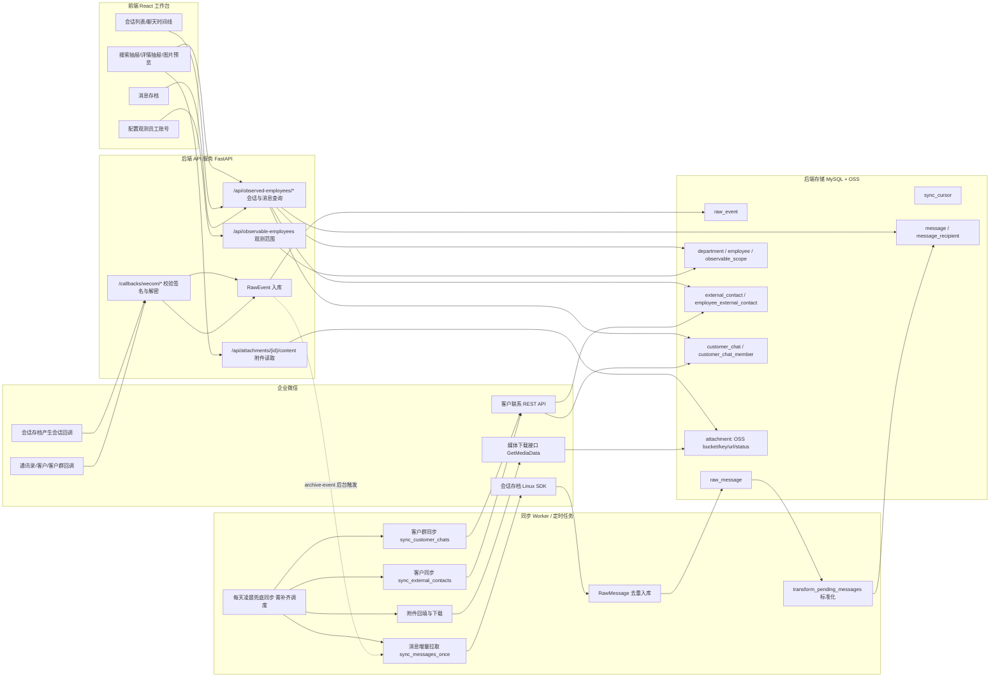
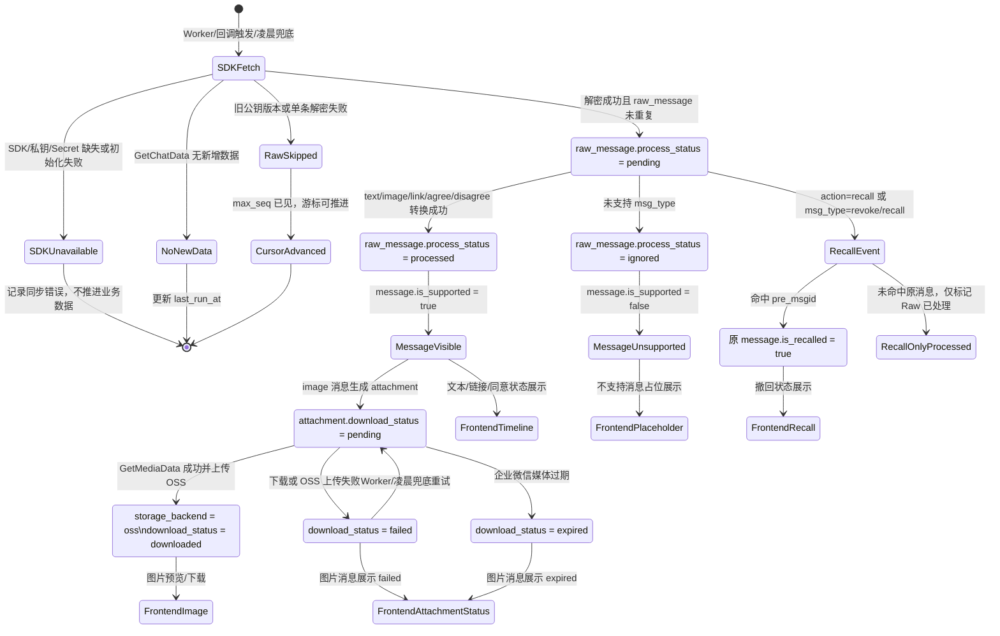

# 企业微信会话存档可视化后台 PRD

面向读者：后端、前端、测试。  
文档日期：2026-07-27。  
依据代码范围：`app/weCom/backend`、`app/weCom/frontend`、`app/weCom/docker-compose.yml`、`README.md`。

## 1. 概述

### 1.1 产品定位

本产品是企业微信会话内容存档的 v1 后台与可视化工作台，覆盖单个企业微信主体下的通讯录基础数据、客户联系、客户群、会话存档消息、图片附件和观测员工配置。当前系统使用固定内部管理员 Token 做后台鉴权，后端负责接入企业微信回调、REST API 和会话存档 Linux SDK，前端提供观测范围配置和消息查看入口。

### 1.2 当前功能范围

已覆盖：

- 企业微信回调接收：通讯录、客户联系、客户群、会话存档同意、产生会话事件。
- 企业微信 REST API：客户列表、客户详情、客户群列表、客户群详情。
- 企业微信会话存档 SDK：按 `seq` 拉取会话数据、解密消息、下载媒体文件。
- 通讯录兜底导入：通过 CLI 或 HTTP CSV 导入员工、部门、观测范围。
- 消息标准化：支持文本、图片、链接、同意/不同意会话存档、撤回消息；其他类型保留 Raw 并展示“不支持消息”占位。
- 会话入口：观测员工的单聊客户会话和客户群会话。
- 前端工作台：观测员工列表、会话列表、聊天时间线、当前会话本地搜索抽屉、详情抽屉、图片预览、移动端三段式切换。
- 数据存储：Raw 表、游标表、通讯录/客户/客户群业务表、消息表、附件表。

当前边界：

- 仅支持单企业主体，不做多租户隔离。
- 仅固定后台 Token，不做 SSO、多角色权限或细粒度授权。
- 通讯录 API 定时同步尚未实现，当前主要依赖回调入 RawEvent 与 CSV 导入。
- 前端无后端不可用、无权限或无数据时不展示假数据，只展示空态。
- 附件当前落地本地 Docker volume；本 PRD 要求调整为 OSS 存储。
- 每天凌晨的兜底数据同步目前代码里没有 cron/调度器，需要作为部署/后端任务补齐。

### 1.3 主要功能

| 模块 | 主要能力 | 用户/系统价值 |
| --- | --- | --- |
| 回调接收 | 校验企业微信加密回调、保存 RawEvent、 archive-event 后台触发消息拉取 | 降低新消息进入系统延迟，保留事件审计来源 |
| 消息同步 | 使用会话存档 SDK 按 `sync_cursor.message_seq` 拉取、解密、Raw 入库、标准化处理 | 建立可查询的会话消息数据库 |
| 客户同步 | 针对已观测员工同步外部联系人列表和详情 | 支撑“学员”会话入口和学员详情 |
| 客户群同步 | 针对已观测员工同步客户群列表、群详情、成员 | 支撑“学员群”入口和群详情 |
| 附件同步 | 根据图片消息生成附件记录并下载媒体 | 支撑图片消息预览 |
| 观测范围配置 | 从企业通讯录选择员工加入/移出观测范围 | 控制前端可查看入口，不删除底层数据 |
| 消息查看 | 按观测员工查看会话列表和聊天时间线 | 运营/管理员可查看指定员工会话存档 |

### 1.4 整体工程流程图

## 2. 企业微信调用说明

### 2.1 后端整体调用机制

后端对企业微信有三类接入方式：

1. 加密回调：
   - 路由：`/callbacks/wecom/{callback_name}`。
   - 支持：`contact`、`customer`、`customer-chat`、`archive-consent`、`archive-event`。
   - 校验：按企业微信 `token + timestamp + nonce + encrypted` 做 SHA1 签名校验；有 `EncodingAESKey` 时解密 XML；校验 CorpID。
   - 入库：将解析后的 payload 写入 `raw_event`，初始 `process_status=pending`。
   - 特殊机制：收到 `archive-event` 后，后台任务异步执行一次 `sync_messages_once`。

2. REST API：
   - token 获取：`/cgi-bin/gettoken?corpid=...&corpsecret=...`。
   - 客户同步：`/cgi-bin/externalcontact/list`、`/cgi-bin/externalcontact/get`。
   - 客户群同步：`/cgi-bin/externalcontact/groupchat/list`、`/cgi-bin/externalcontact/groupchat/get`。
   - Secret：使用 `WECOM_CUSTOMER_API_SECRET`，旧变量 `WECOM_CUSTOMER_SECRET` 仅作兼容兜底。

3. 会话存档 Linux SDK：
   - 后端不在主进程直接加载 SDK，而是通过 `WeComArchiveClient` 启动 `sdk_worker.py` 子进程，规避 C SDK 与 Python/SQLAlchemy OpenSSL 符号冲突。
   - 子进程调用 `GetChatData` 拉取会话密文，再用私钥解密 `encrypt_random_key`，调用 `DecryptData` 得到明文 JSON。
   - 媒体下载调用 `GetMediaData`，当前本地落盘；目标改为 OSS。

#### 消息状态机说明

消息状态机以 `raw_message.process_status` 为主状态，以 `message.is_supported`、`message.is_recalled` 和 `attachment.download_status` 作为展示与附件子状态。后端需要保证每个状态迁移可幂等重试：Raw 消息按 `seq` 和 `msgid` 去重，标准化消息按 `msgid` 去重，附件按 `message_id` 回填并按下载状态重试。

状态约束：

- `raw_message.pending`：只表示 Raw 已入库但尚未完成业务转换；Worker 可按 `msg_time` 或 `seq` 继续处理。
- `raw_message.processed`：消息已完成转换，或撤回事件已完成处理；重复 Raw 也会被标记为已处理。
- `raw_message.ignored`：消息类型暂不支持完整解析，但仍应生成可展示占位并保留 `raw_payload`。
- `message.is_recalled=true`：前端必须优先展示撤回态，不展示原消息正文或图片。
- `attachment.failed`：允许后续 Worker 或凌晨兜底同步重试。
- `attachment.expired`：表示企业微信媒体已过期，应停止高频重试，仅保留状态供前端和测试识别。

### 2.2 会话存档同步

消息同步入口：`sync_messages_once(db)`。

流程：

1. 读取或初始化 `sync_cursor.cursor_type=message_seq`，默认从 `0` 开始。
2. 调用 SDK `GetChatData(seq, limit)`。
3. 首次无游标时按 `MESSAGE_BOOTSTRAP_MAX_BATCHES` 连续拉取；已有游标时单轮增量拉取。
4. 按 `msgid` 或 `seq` 去重写入 `raw_message`。
5. 游标推进到本轮见到的最大 `seq`，包括旧 key 无法解密但 SDK 已返回的 seq。
6. `transform_pending_messages` 将 RawMessage 标准化为 `message`、`message_recipient`、`attachment`。
7. 回填缺失单聊关系和群聊会话，保证消息先于客户/群资料到达时前端仍有会话入口。

支持消息：

- `text`：写入 `message.content_text`。
- `image`：写入 `message.content_text=[图片]`，并生成 `attachment`。
- `link`：写入链接标题、URL、描述。
- `agree` / `disagree`：展示为“同意会话存档”或“不同意会话存档”。
- `recall` / `revoke`：找到原消息后标记 `is_recalled=true`，写入 `recalled_at` 和 `recall_raw_message_id`。

不支持消息：

- 写入 RawMessage，标准化 Message 的 `is_supported=false`，前端显示“不支持的 {msg_type} 消息”。
- Raw payload 继续保留，便于后续补充解析。

### 2.3 通讯录同步

现状：

- 通讯录变更回调会被统一保存到 `raw_event`，但代码中未实现 RawEvent 到 `department` / `employee` 的自动处理器。
- 员工与部门数据当前可通过 CSV 导入补齐：
  - CLI：`wecomctl import employees --file employees.csv`
  - HTTP：`POST /api/observable-employees/import`
- CSV 最小必填 `userid`；可选 `name`、`alias`、`mobile`、`email`、`avatar`、`position`、`status`、`department_id`、`department_name`、`scope_status`、`scope_reason`。

PRD 要求：

- 后端需补齐通讯录 API 同步任务，至少支持部门列表、部门员工列表、员工详情的全量/增量 upsert。
- 通讯录回调仅作为实时事件入口，失败时由每天凌晨兜底同步修复。
- CSV 导入保留为临时兜底和人工修复工具，不反向写企业微信。

### 2.4 客户同步

同步入口：`sync_external_contacts(db, client, userids=None)`。

默认范围：

- 如果未传 `userids`，读取 `observable_employee_scope.scope_status=enabled` 的员工。
- 如员工不存在，会创建最小 `employee` 行，`name=userid`。

调用流程：

1. 对每个观测员工调用 `externalcontact/list` 获取 `external_userid` 列表。
2. 对每个外部联系人调用 `externalcontact/get` 获取客户详情和 `follow_user`。
3. upsert `external_contact`。
4. upsert `employee_external_contact`，保存员工与客户关系、备注、描述、标签、添加时间等。
5. MySQL/MariaDB 下使用 `GET_LOCK("wecom_sync_external_contacts")` 防并发同步。

错误处理：

- 企业微信返回无客户类错误码 `84061`、`84069` 时按空列表处理。
- 其他 API 错误记录到返回 `errors`，不中断其他员工同步。

### 2.5 客户群同步

同步入口：`sync_customer_chats(db, client, owner_userids=None)`。

默认范围：

- 如果未传 `owner_userids`，读取 `observable_employee_scope.scope_status=enabled` 的员工。

调用流程：

1. 对每个观测员工调用 `externalcontact/groupchat/list`，按 cursor 翻页。
2. 对每个 `chat_id` 调用 `externalcontact/groupchat/get` 获取群详情。
3. upsert `customer_chat`：群名、群主、公告、成员数、管理员列表、创建时间、状态。
4. upsert `customer_chat_member`：成员 userid、类型、群昵称、加入时间、角色、邀请人、在群状态。
5. MySQL/MariaDB 下使用 `GET_LOCK("wecom_sync_customer_chats")` 防并发同步。

兜底：

- 如果群消息先于客户群 API 资料同步到达，消息转换会基于 `roomid` 创建最小 `customer_chat` 与企业成员关系，`raw_payload.source=message_fallback`；后续群 API 同步补全。

### 2.6 附件机制：从本地卷调整为 OSS

现状：

- `attachment` 表已有对象存储相关字段：`storage_backend`、`storage_bucket`、`storage_key`、`storage_url`。
- 当前下载实现将文件写入 `attachment_storage_root` 本地路径，设置 `storage_backend=local_volume`。
- API 读取 `/api/attachments/{id}/content` 时从本地路径返回 `FileResponse`。
- 前端图片 URL 使用 `/api/attachments/{id}/content?token=...`。

目标调整：

- 附件统一存储到 OSS，后端本地卷不再作为生产存储。
- `download_pending_attachments` 下载媒体后上传 OSS，成功后写：
  - `storage_backend="oss"`
  - `storage_bucket=OSS bucket`
  - `storage_key=对象 key`
  - `storage_url=可选内部访问 URL 或 CDN URL`
  - `download_status="downloaded"`
  - `downloaded_at=当前时间`
- OSS key 建议沿用当前日期分区：`wecom-archive/{yyyy}/{MM}/{dd}/{attachment_id}_{md5_or_msgid}.{ext}`。
- 不建议前端直接持久化公开 OSS URL。推荐后端附件 API 根据 `storage_key` 生成短期签名 URL，或由后端代理流式读取 OSS。
- 附件状态约束：
  - `pending`：等待下载。
  - `downloaded`：已上传 OSS，可预览/下载。
  - `failed`：下载或上传失败，可重试。
  - `expired`：企业微信媒体已过期，不再无限重试。
- 测试需覆盖 OSS 上传成功、上传失败、签名 URL 生成、无权限访问、过期媒体、历史 `local_volume` 兼容策略。

### 2.7 每天凌晨兜底数据同步机制

现状：

- `wecom-worker` 当前在 while true 循环中高频执行消息、客户、客户群、附件同步。
- 代码中没有 cron 表达式、APScheduler 或 Kubernetes CronJob 配置。

PRD 要求：

- 新增每天凌晨兜底同步任务，建议执行时间：`Asia/Shanghai` 每日 `02:00`。
- 任务范围：
  - 通讯录全量或准全量同步：部门、员工。
  - 客户同步：所有 enabled 观测员工的客户关系。
  - 客户群同步：所有 enabled 观测员工的客户群与成员。
  - 会话存档同步：从 `message_seq` 游标继续拉取，补偿回调遗漏。
  - 附件同步：回填图片附件并重试 `pending/failed`，跳过或低频处理 `expired`。
- 互斥要求：
  - 与实时 worker 或回调触发同步共享同一互斥机制，避免同一数据段并发写入。
  - 消息同步建议增加 MySQL 锁，例如 `wecom_sync_messages`，与 README 中描述一致。
- 可观测性：
  - 每类任务写入开始时间、结束时间、成功数、失败数、错误摘要。
  - 当前可复用 `sync_cursor.last_run_at`、`last_success_at`、`last_error`，但建议新增独立 `sync_job_run` 表用于测试和运维审计。

## 3. 后端存储机制

### 3.1 总体存储机制

后端采用“Raw 数据 + 标准化业务表 + 游标/状态表”的存储模式：

- Raw 层：完整保存企业微信回调和会话存档明文 payload，便于审计、重放和后续补充解析。
- 游标层：记录各同步任务进度、上次运行和错误。
- 业务层：将通讯录、客户、客户群、消息、附件拆分成可查询表。
- 状态层：通过 `process_status`、`download_status`、`is_deleted`、`is_active` 等字段支持重试、软删除和前端展示兜底。

### 3.2 表字段设计

#### raw_event

用途：保存企业微信回调原始事件。

| 字段 | 类型 | 说明 |
| --- | --- | --- |
| id | bigint pk | 主键 |
| event_source | varchar(64) | 来源：contact、customer_chat、archive_event 等 |
| event_type | varchar(128) | 企业微信事件类型 |
| event_key | varchar(256) unique | 幂等键，优先由事件关键字段生成 |
| external_userid | varchar(128) | 外部联系人 ID，预留 |
| chat_id | varchar(128) | 客户群 ID，预留 |
| userid | varchar(128) | 员工 ID，预留 |
| event_time_ms / event_time | bigint / datetime | 企业微信事件时间，预留 |
| payload | json | 解密后的回调 payload 与 query |
| process_status | varchar(32) | pending / processed / failed |
| process_error | text | 处理错误 |
| received_at / processed_at | datetime | 接收与处理时间 |
| created_at / updated_at | datetime | 系统时间 |

#### sync_cursor

用途：保存同步游标和运行状态。

| 字段 | 类型 | 说明 |
| --- | --- | --- |
| id | bigint pk | 主键 |
| cursor_type | varchar(64) unique | 如 `message_seq` |
| cursor_value | varchar(256) | 游标值 |
| last_success_at | datetime | 最近成功时间 |
| last_run_at | datetime | 最近运行时间 |
| last_error | text | 最近错误 |
| created_at / updated_at | datetime | 系统时间 |

#### raw_message

用途：保存会话存档 Raw 消息和处理状态。

| 字段 | 类型 | 说明 |
| --- | --- | --- |
| id | bigint pk | 主键 |
| seq | bigint unique | 企业微信会话存档 seq |
| msgid | varchar(128) unique | 企业微信消息 ID |
| publickey_ver | int | 公钥版本，预留 |
| encrypt_random_key | text | 加密随机 key，预留 |
| encrypt_chat_msg | text | 加密消息体，预留 |
| decrypt_payload | json | 解密后的消息 JSON |
| msg_action | varchar(32) | send / recall 等 |
| msg_type | varchar(64) | text / image / link 等 |
| msg_time_ms / msg_time | bigint / datetime | 消息时间 |
| process_status | varchar(32) | pending / processed / ignored / failed |
| process_error | text | 转换错误 |
| fetched_at / decrypted_at / processed_at | datetime | 拉取、解密、处理时间 |
| created_at / updated_at | datetime | 系统时间 |

#### department

用途：企业微信部门。

| 字段 | 类型 | 说明 |
| --- | --- | --- |
| id | bigint pk | 主键 |
| department_id | bigint unique | 企业微信部门 ID |
| parent_department_id | bigint | 父部门 ID |
| name / name_en | varchar | 部门中英文名称 |
| order_no | int | 排序 |
| is_deleted | bool | 是否软删除 |
| raw_payload | json | 企业微信原始部门数据 |
| last_synced_at | datetime | 最近同步时间 |
| created_at / updated_at | datetime | 系统时间 |

#### employee

用途：企业微信员工通讯录。

| 字段 | 类型 | 说明 |
| --- | --- | --- |
| id | bigint pk | 主键 |
| userid | varchar(128) unique | 企业微信员工 userid |
| name / alias | varchar | 姓名、别名 |
| mobile / email | varchar | 手机、邮箱 |
| avatar | text | 头像 |
| position | varchar | 职位 |
| department_ids | json | 所属部门列表 |
| main_department_id | bigint | 主部门 |
| status | int | 企业微信状态 |
| is_deleted | bool | 是否软删除 |
| raw_payload | json | 企业微信原始员工数据 |
| last_synced_at | datetime | 最近同步时间 |
| created_at / updated_at | datetime | 系统时间 |

#### observable_employee_scope

用途：前端可观测员工范围。

| 字段 | 类型 | 说明 |
| --- | --- | --- |
| id | bigint pk | 主键 |
| userid | varchar(128) unique | 员工 userid |
| scope_status | varchar(32) | enabled / disabled |
| scope_reason | varchar(500) | 加入或移出原因 |
| created_by / updated_by | varchar(128) | 操作人，当前固定 internal_admin |
| created_at / updated_at | datetime | 系统时间 |

约束：该表只控制前端入口，不删除底层通讯录、客户、客户群或消息。

#### external_contact

用途：客户/学员主数据。

| 字段 | 类型 | 说明 |
| --- | --- | --- |
| id | bigint pk | 主键 |
| external_userid | varchar(128) unique | 外部联系人 ID |
| name | varchar(255) | 微信昵称 |
| avatar | text | 头像 |
| type / gender | int | 企业微信客户类型、性别 |
| unionid | varchar(128) | unionid |
| corp_name / corp_full_name | varchar | 外部企业简称/全称 |
| is_deleted | bool | 是否软删除 |
| raw_payload | json | 企业微信原始客户数据 |
| last_synced_at | datetime | 最近同步时间 |
| created_at / updated_at | datetime | 系统时间 |

#### employee_external_contact

用途：员工与客户关系。

| 字段 | 类型 | 说明 |
| --- | --- | --- |
| id | bigint pk | 主键 |
| userid | varchar(128) | 员工 userid |
| external_userid | varchar(128) | 客户 external_userid |
| remark | varchar(255) | 员工对客户备注 |
| description | text | 描述 |
| remark_corp_name | varchar(255) | 备注企业名 |
| remark_mobiles | json | 备注手机号 |
| tag_ids | json | 标签 ID |
| add_way | int | 添加方式 |
| add_time_ms / add_time | bigint / datetime | 添加时间 |
| is_deleted | bool | 是否删除关系 |
| raw_payload | json | follow_user 原始数据 |
| last_synced_at | datetime | 最近同步时间 |
| created_at / updated_at | datetime | 系统时间 |

唯一约束：`userid + external_userid`。

#### customer_chat

用途：客户群主数据。

| 字段 | 类型 | 说明 |
| --- | --- | --- |
| id | bigint pk | 主键 |
| chat_id | varchar(128) unique | 客户群 ID / roomid |
| name | varchar(255) | 群名 |
| owner_userid | varchar(128) | 群主 userid |
| notice | text | 群公告 |
| member_count | int | 成员数 |
| admin_userids | json | 管理员列表 |
| create_time_ms / create_time | bigint / datetime | 创建时间 |
| status | varchar(32) | active / unknown 等 |
| raw_payload | json | 企业微信原始群数据或 fallback 来源 |
| last_synced_at | datetime | 最近同步时间 |
| created_at / updated_at | datetime | 系统时间 |

#### customer_chat_member

用途：客户群成员。

| 字段 | 类型 | 说明 |
| --- | --- | --- |
| id | bigint pk | 主键 |
| chat_id | varchar(128) | 客户群 ID |
| member_userid | varchar(128) | 成员 userid 或 external_userid |
| member_type | varchar(32) | employee / external_contact |
| name | varchar(255) | 成员名称 |
| group_nickname | varchar(255) | 群昵称 |
| join_time_ms / join_time | bigint / datetime | 入群时间 |
| join_scene | int | 入群场景 |
| role | varchar(32) | owner / member |
| invitor_userid | varchar(128) | 邀请人 |
| is_active | bool | 是否仍在群 |
| left_at | datetime | 离群时间 |
| raw_payload | json | 企业微信原始成员数据 |
| last_synced_at | datetime | 最近同步时间 |
| created_at / updated_at | datetime | 系统时间 |

唯一约束：`chat_id + member_userid`。

#### message

用途：标准化消息。

| 字段 | 类型 | 说明 |
| --- | --- | --- |
| id | bigint pk | 主键 |
| raw_message_id | bigint unique fk | 对应 raw_message |
| seq | bigint | 会话存档 seq |
| msgid | varchar(128) unique | 消息 ID |
| action | varchar(32) | send / recall |
| msg_type | varchar(64) | 消息类型 |
| conversation_type | varchar(32) | single / room |
| roomid | varchar(128) | 群聊 roomid |
| sender_id | varchar(128) | 发送人 ID |
| sender_type | varchar(32) | employee / external_contact |
| sender_name | varchar(255) | 发送人名称 |
| content_text | text | 文本或展示摘要 |
| link_title / link_url / link_description | varchar/text | 链接消息字段 |
| msg_time_ms / msg_time | bigint / datetime | 消息时间 |
| is_external | bool | 是否外部联系人发送 |
| is_recalled | bool | 是否已撤回 |
| recalled_at | datetime | 撤回时间 |
| recall_raw_message_id | bigint | 撤回事件 RawMessage |
| is_supported | bool | 当前版本是否支持完整展示 |
| raw_payload | json | 原始消息 payload |
| created_at / updated_at | datetime | 系统时间 |

#### message_recipient

用途：消息收件人。

| 字段 | 类型 | 说明 |
| --- | --- | --- |
| id | bigint pk | 主键 |
| message_id | bigint fk | 标准化消息 |
| msgid | varchar(128) | 消息 ID |
| recipient_id | varchar(128) | 收件人 ID |
| recipient_type | varchar(32) | employee / external_contact |
| recipient_name | varchar(255) | 收件人名称 |
| created_at | datetime | 系统时间 |

唯一约束：`message_id + recipient_id`。

#### attachment

用途：消息附件元数据和对象存储索引。

| 字段 | 类型 | 说明 |
| --- | --- | --- |
| id | bigint pk | 主键 |
| message_id | bigint fk | 标准化消息 |
| msgid | varchar(128) | 消息 ID |
| attachment_type | varchar(64) | image / file / voice 等 |
| sdkfileid | text | 企业微信媒体 ID |
| md5sum | varchar(128) | 文件 md5 |
| file_size | bigint | 文件大小 |
| file_name | varchar(500) | 文件名 |
| file_ext | varchar(64) | 扩展名 |
| storage_backend | varchar(64) | 目标为 `oss`，历史为 `local_volume` |
| storage_bucket | varchar(255) | OSS bucket |
| storage_key | text | OSS object key |
| storage_url | text | 可选 CDN/内部 URL |
| download_status | varchar(32) | pending / downloaded / failed / expired |
| download_error | text | 下载或上传错误 |
| downloaded_at | datetime | 成功时间 |
| raw_payload | json | 原始附件字段 |
| created_at / updated_at | datetime | 系统时间 |

## 4. 前端交互说明

### 4.1 前端技术与信息来源

前端为 React + Vite + TypeScript，主要代码在：

- `src/App.tsx`：页面结构、交互状态、列表过滤、抽屉和弹窗。
- `src/api/client.ts`：后端 API 调用、Token 注入、失败兜底。
- `src/api/types.ts`：前端数据类型。
- `src/styles.css`：桌面四栏布局、配置页穿梭框、移动端响应式布局。

本次 PRD 的前端说明通过静态阅读前端代码和测试用例提取。若后续需要真实截图，可启动 Vite 后用浏览器/Playwright 截图，但当前文档不依赖运行时截图。

补充截图：

以下截图来自本地 Docker 环境 `http://localhost:5173`，截图时间为 2026-07-27。当前本地数据中已有观测员工，但所选员工暂无匹配会话和消息，因此截图同时展示了正常布局与空态兜底。

| 截图 | 说明 |
| --- | --- |
|  | 消息存档桌面端四栏布局：左侧菜单、观测员工范围、会话列表、聊天区；展示观测员工已加载但会话/消息为空的兜底态。 |
|  | 当前会话搜索抽屉：文本、发送人、时间范围过滤项，以及本地搜索无结果状态。 |
|  | 配置页穿梭框：企业通讯录按部门分组、已观测员工列表、添加/移出操作区。 |
|  | 移动端布局：顶部三段切换 `员工 / 会话 / 聊天`，当前展示员工范围面板与空态。 |

### 4.2 全局布局

桌面端：

- 顶部栏：品牌区“会话存档”、副标题“查看原始会话存档”、同步状态胶囊“全局同步 09:34”。当前同步时间为静态展示，未接后端状态。
- 左侧菜单：功能目录 -> 会话消息 -> 消息存档 / 配置观测员工账号。
- 消息存档主界面：四栏结构，依次为菜单、观测员工范围、会话列表、聊天区。
- 配置页：菜单右侧为配置面板，包含企业通讯录、操作按钮、已观测员工。

移动端：

- 顶部出现 `员工 / 会话 / 聊天` 三段切换。
- 主区同一时间显示一个流程面板。
- 配置页在移动端改为上下排列的通讯录、操作按钮、已观测员工。

### 4.3 鉴权、加载与兜底

接口鉴权：

- 前端从 `VITE_INTERNAL_ADMIN_TOKEN` 读取 Token，未配置时使用 `dev-admin-token`。
- 普通 GET 请求在 `Authorization: Bearer {token}` 中传递。
- 附件图片为 `` 加载，使用 query token：`/api/attachments/{id}/content?token={token}`。

加载机制：

- 首次渲染调用 `fetchEmployees()` 和 `fetchDirectoryEmployees()`。
- 选中员工或切换会话类型时调用 `fetchConversations(userid, type)`。
- 选中会话时调用 `fetchMessages(userid, conversation)`。
- 当前没有显式 loading skeleton；请求完成前列表保持当前状态或空态。

兜底机制：

- `getJson(path, fallback)` 对接口失败、非 2xx、网络异常统一返回 fallback。
- 观测员工 fallback：`{items: []}`，界面显示“暂无观测员工”。
- 会话 fallback：`{items: []}`，界面显示“没有匹配会话”。
- 消息 fallback：`{items: []}`，界面显示“暂无消息”。
- 无权限和后端不可用在前端都表现为空态，测试需结合 Network 或后端日志判断原因。

### 4.4 消息存档页

#### 观测员工范围

元素：

- 搜索框：placeholder 为“员工姓名、userid、部门”。
- 员工卡片：头像、姓名、`userid · department`、会话数 badge。
- 空态：暂无观测员工 / 请到配置页添加账号。

数据来源：

- `GET /api/observable-employees`
- 字段：`userid`、`name`、`avatar`、`department`、`scope_status`、`conversation_count`

约束与兜底：

- 后端仅返回 `scope_status=enabled` 的员工。
- 前端再次按姓名、userid、部门本地过滤。
- 员工无部门时显示“未配置部门”。
- 员工头像为空时使用姓名首字作为头像占位。
- 首次加载后默认选中第一个观测员工；原选中员工被移出后切换到新列表第一个。

排序与更新：

- 后端按 `Employee.name asc, Employee.userid asc` 排序。
- 添加/移出观测员工后重新调用 `loadEmployees()` 更新列表。

#### 会话列表

元素：

- 当前观测员工标题。
- 会话搜索框：placeholder 为“学员、群名、消息摘要”。
- 重置按钮：清空会话关键词。
- Tab：全部、学员、学员群。
- 会话项：头像/群图标、展示名、类型 badge、排序依据 badge、摘要、最近查看、最近消息、群成员数/角色/群主或微信昵称。
- 空态：没有匹配会话 / 请调整会话类型或关键词。

数据来源：

- `GET /api/observed-employees/{userid}/conversations?type={all|student|customer_chat}`
- 字段：`conversation_type`、`external_userid`、`chat_id`、`display_name`、`wechat_name`、`avatar`、`summary`、`last_message_time`、`last_viewed_at`、`sort_basis`、`member_count`、`owner_name`、`observer_role`

约束与兜底：

- 后端要求管理员 Token，并校验 `{userid}` 必须在 enabled 观测范围内。
- 单聊会话来自 `employee_external_contact + external_contact`。
- 群会话来自 `customer_chat + customer_chat_member`，且当前观测员工必须是活跃成员。
- 前端把 API 类型 `customer_chat` 展示为“学员群”。
- 无摘要时显示“暂无消息”。
- 无时间时显示“—”。

排序与更新：

- 后端排序：`last_viewed_at or last_message_time or datetime.min` 倒序。
- 后端返回 `sort_basis` 表示排序依据：有查看历史为 `last_viewed`，否则为 `last_message`。
- 前端还有一次本地类型与关键词过滤，但不改变后端顺序。
- 切换员工或 Tab 后重新拉取会话，并默认选中第一个或保留同 key 会话。

注意：

- 后端已有 `POST /conversation-view-history`，但前端当前没有在选中会话时调用，因此最近查看排序不会被前端实际更新。建议补齐：用户点击会话后写查看历史，再刷新会话列表或局部更新。

#### 聊天时间线

元素：

- 聊天头：会话头像、展示名、类型说明。
- 工具按钮：搜索对话消息、打开会话详情。
- 消息气泡：按发送人区分自己/对方；观测员工本人消息为右侧 `self`。
- 支持文本、链接卡、图片预览、撤回状态、不支持消息占位。
- 底部标记：禁用输入框“到底了”。
- 空态：暂无消息 / 当前会话还没有可查看的存档消息。

数据来源：

- 单聊：`GET /api/observed-employees/{userid}/student-conversations/{external_userid}/messages`
- 群聊：`GET /api/observed-employees/{userid}/customer-chat-conversations/{chat_id}/messages`
- 字段：`message_id`、`msgid`、`msg_type`、`is_supported`、`sender`、`content`、`msg_time`、`is_recalled`、`recalled_at`

约束与兜底：

- 单聊查询限制为当前观测员工与当前客户之间互发消息。
- 群聊查询要求当前观测员工是群活跃成员，否则后端 403，前端显示空态。
- 后端当前 `limit=50`，无分页游标；前端只显示首批消息。
- 后端按 `msg_time asc` 返回，前端保持时间线顺序。
- 图片只有 `download_status=downloaded` 且后端返回 `url` 时渲染 ``；否则展示“图片消息 · {download_status}”。
- 不支持消息显示 Raw 已保留说明，不展示业务消息体。

消息类型展示与交互说明：

> 生产截图建议放置在下表“生产截图”列。截图应覆盖当前消息在聊天区的气泡展示，以及有交互的二级状态，例如图片预览弹窗。

| 消息类型                 | 生产截图               | 数据来源                                                                                                                                              | 页面展示                                                                                       | 用户交互                                                         | 约束与兜底                                                                                                   |
| -------------------- | ------------------ | ------------------------------------------------------------------------------------------------------------------------------------------------- | ------------------------------------------------------------------------------------------ | ------------------------------------------------------------ | ------------------------------------------------------------------------------------------------------- |
| 文本消息 `text`          | 待补：文本消息气泡截图        | `message.msg_type=text`；`message.content.text` 来自后端 `Message.content_text`，由 Raw payload `text.content` 转换。                                       | 以普通聊天气泡展示正文；发送人为当前观测员工时靠右展示，否则靠左展示；气泡上方显示发送人展示名。                                           | 无特殊点击行为；文本按气泡宽度自动换行。                                         | 若 `content.text` 为空，前端回退到链接标题、附件类型或空字符串；测试需覆盖长文本换行、中文/英文混排、特殊字符展示。                                      |
| 图片消息 `image`         | 待补：图片气泡 + 图片预览弹窗截图 | `message.msg_type=image`；`message.content.attachment` 来自 `attachment` 表；图片访问 URL 为 `/api/attachments/{attachment_id}/content`，前端追加 `token` query。 | `download_status=downloaded` 且存在 `url` 时，气泡内直接展示图片缩略图；未下载或失败时展示“图片消息 · {download_status}”。 | 点击已下载图片缩略图打开“图片消息预览”弹窗；点击关闭按钮关闭预览。                           | 当前生产目标为 OSS：后端应通过代理或短期签名 URL 返回图片。若 `pending/failed/expired`，前端不渲染图片，只展示状态；`expired` 表示企业微信媒体过期，不应高频重试。 |
| 链接消息 `link`          | 待补：链接卡片截图          | `message.msg_type=link`；`message.content.link.title/url/description` 来自后端 `Message.link_title/link_url/link_description`。                         | 以链接卡片展示，标题加粗，描述优先展示 `description`，没有描述时展示 URL。                                             | 当前代码仅展示卡片，不包含显式跳转按钮或 `a` 标签；如产品要求可点击打开链接，前端需改为安全链接组件并补充跳转策略。 | 若标题为空显示“链接消息”；若 `link_url` 为空，后端不会返回 link 对象，前端将退回普通文本气泡。测试需覆盖标题缺失、描述缺失、超长 URL。                         |
| 撤回消息 `recall/revoke` | 待补：撤回状态气泡截图        | 撤回事件来自 Raw payload `action=recall` 或 `msg_type=revoke/recall`；后端命中 `pre_msgid` 后标记原 `message.is_recalled=true`、写入 `recalled_at`。                  | 前端优先展示“该消息已被撤回”文本和“已撤回”状态 badge，不展示原消息正文、链接或图片。                                            | 无点击行为；即使原消息是图片或链接，也不允许打开原内容。                                 | 若撤回事件未命中原消息，仅 Raw 事件标记处理完成，不会生成可见撤回气泡。测试需覆盖文本撤回、图片撤回、原消息缺失三类场景。                                         |
| 当前不支持消息              | 待补：不支持消息占位截图       | `message.is_supported=false`；`message.msg_type` 为当前未完整解析的类型，例如 `file`、`voice`、`video`、`miniprogram` 等；Raw payload 保存在后端。                          | 普通气泡内显示“暂不支持的 {msg_type} 消息”，并展示占位卡片：“Raw 消息已保留，当前版本不写入业务消息体。”                             | 无下载、播放或预览行为；占位仅用于告知当前版本不支持展示。                                | 后端仍需保留 RawMessage 与 Message 占位，保证时间线完整。后续新增类型解析时，可基于 Raw payload 回填业务字段和附件。                             |

消息类型优先级：

1. `is_recalled=true` 优先级最高，直接展示撤回态。
2. 有已下载图片附件时展示图片缩略图。
3. 有附件但未下载成功时展示附件状态占位。
4. `is_supported=false` 展示不支持消息占位。
5. 有 link 对象时展示链接卡片。
6. 其他支持类型按普通文本气泡展示。

#### 搜索对话消息抽屉

元素：

- 文本内容输入框。
- 发送消息的用户下拉框。
- 开始时间、结束时间。
- 清空按钮。
- 检索结果列表。
- 时间范围无效空态和无结果空态。

数据来源：

- 现状：基于当前已加载 `messages` 在浏览器本地过滤。
- 可用后端接口：`GET /api/observed-employees/{userid}/conversations/{conversation_type}/{conversation_id}/message-search`。

约束与兜底：

- 当前搜索范围仅当前已打开会话，并且仅限已加载的最多 50 条消息。
- 如果开始时间晚于结束时间，前端直接返回空结果并提示“开始时间不能晚于结束时间”。
- 发送人列表来自当前 messages 的 sender 去重。

建议：

- 若产品要求搜索当前会话全量历史，应改为调用后端 message-search API，并补充开始/结束时间参数。
- 若要跨员工或跨会话搜索，应新增独立 API 和权限边界。

#### 会话详情抽屉

元素：

- 身份区：头像、展示名、类型说明。
- 信息块：群信息/学员信息，展示名、微信昵称、成员数、群主。
- 查看上下文：观测员工、排序依据、最近查看、最近消息、搜索边界。

数据来源：

- 现状：直接使用会话列表中的 `selectedConversation` 和 `selectedEmployee`。
- 后端存在详情 API：
  - `GET /api/observed-employees/{userid}/students/{external_userid}`
  - `GET /api/observed-employees/{userid}/customer-chats/{chat_id}`

建议：

- 详情抽屉应调用后端详情 API 获取完整学员资料、群公告、成员列表，避免只展示列表摘要字段。

### 4.5 配置观测员工账号页

元素：

- 顶部标题：企业通讯录 / 配置观测员工账号。
- 已观测数量胶囊。
- 左侧企业通讯录面板：搜索框、按部门分组的树形列表、员工行。
- 中间操作：添加、移出。
- 右侧已观测员工面板：选择数量、状态提示、已观测员工列表。

数据来源：

- 企业通讯录：`GET /api/directory-employees`
- 已观测员工：`GET /api/observable-employees`
- 添加/移出：`POST /api/observable-employees`，payload 为 `{userid, scope_status}`。

约束与兜底：

- 企业通讯录仅展示 `employee.is_deleted=false`。
- 前端按部门分组；无部门显示“未分组”。
- 已在观测范围内的员工显示“已观测”，点击不会加入选择，并提示“该员工已在观测范围内，无需重复添加”。
- 添加按钮在左侧未选择员工时禁用。
- 移出按钮在右侧未选择员工时禁用。
- 移出仅将 `scope_status` 改为 `disabled`，不删除历史数据。

排序与更新：

- 通讯录后端按 `Employee.name asc, Employee.userid asc` 排序，前端按部门分组后保持分组内顺序。
- 已观测员工后端同样按 `Employee.name asc, Employee.userid asc` 排序。
- 添加/移出成功后调用 `loadEmployees()` 刷新两侧数据。

### 4.6 测试关注点

后端：

- 回调签名、解密、CorpID 校验、RawEvent 幂等。
- SDK 子进程初始化失败、私钥缺失、旧 publickey 版本不可解密、游标推进。
- RawMessage 按 `seq` 和 `msgid` 去重。
- 文本、图片、链接、agree/disagree、撤回、不支持类型转换。
- 客户与客户群同步的分页、错误不中断、MySQL 锁。
- 通讯录同步任务补齐后的 upsert、软删除、凌晨兜底修复。
- OSS 附件上传、签名访问、过期媒体、失败重试。

前端：

- 无权限、后端不可用、空数据均展示空态，不展示 mock 数据。
- 员工/会话/消息三级联动选择。
- 会话类型过滤和关键词过滤。
- 图片 `downloaded` 与非 downloaded 状态展示。
- 撤回和不支持消息展示。
- 搜索抽屉本地过滤边界，或后续切换后端搜索后的接口参数。
- 配置页添加/移出观测员工后刷新列表。
- 移动端 `员工 / 会话 / 聊天` 面板切换。
