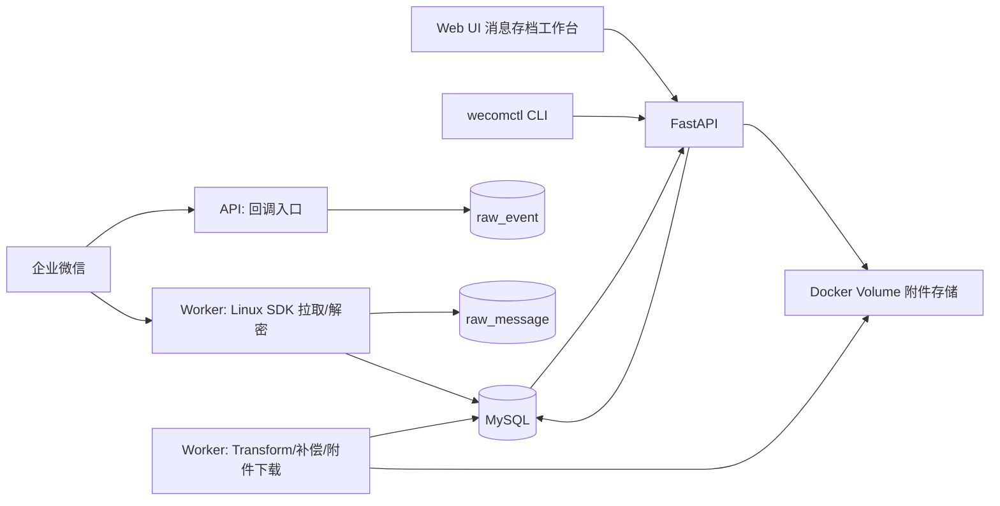

# Tech_weCom_sync_service

## 1. 目标与范围

本技术规格用于指导企业微信聊天同步服务进入开发阶段。服务目标是：

- 通过企业微信会话内容存档能力采集、解密、解析聊天消息。
- 同步通讯录、外部联系人、客户群及群成员元数据。
- 将 Raw 数据、处理状态和标准化业务数据落入 MySQL。
- 为前端“消息存档”工作台提供员工观测范围、会话列表、聊天时间线、详情面板、消息搜索和附件预览 API。
- 在 Docker 环境中运行企业微信 Linux SDK 相关能力。
- 提供 CLI，辅助生成和校验企业微信后台需要配置的回调地址。

v1 范围：

- 单个企业微信主体。
- Python + FastAPI 后端。
- MySQL 数据库。
- API 与 Worker 分离部署。
- Worker + DB 游标调度，不引入 Redis。
- 附件使用 Docker 本地卷存储，通过后端鉴权 API 代理访问。
- 前端用户身份采用内部固定管理员模型，预留后续接入飞书/SSO。

暂不纳入 v1：

- 飞书 ChatBI Agent 分析能力。
- 多企业微信主体隔离。
- 文件、语音、视频、小程序、会话记录等复杂消息类型的完整解析。
- 外部对象存储生产化接入。
- 完整多用户权限体系。

## 2. 参考资料

- 服务设计：`spec/企业微信聊天同步服务.md`
- 企业微信接口索引：`spec/企业微信接口文档汇总.md`
- 前端 Demo：`demo/Web-Prototype/message-archive-prototype.html`
- 设计交付：`demo/Web-Prototype/DESIGN-HANDOFF.md`
- 设计清单：`demo/Web-Prototype/DESIGN-MANIFEST.json`

企业微信官方接口参考：

- 基础配置、access_token、回调配置。
- 通讯录、部门、成员详情、通讯录回调。
- 客户联系、客户详情、客户群列表、客户群详情。
- 会话内容存档、获取会话内容、开启成员列表、同意情况、会话回调事件。

## 3. 已对齐的关键决策

| 主题 | 决策 |
| --- | --- |
| 服务端技术栈 | Python + FastAPI |
| 数据库 | MySQL |
| 迁移工具 | Alembic |
| 部署 | Docker Compose |
| 服务拆分 | API 与 Worker 分离 |
| 任务调度 | Worker + DB 游标 |
| 企业微信应用配置 | 按能力分组：通讯录、客户联系、会话存档 |
| 回调入口 | 按事件类型分路径 |
| 会话采集 | 回调触发 + Worker 定时补偿 |
| 附件存储 | 本地 Docker volume |
| 附件访问 | 后端鉴权 API 代理 |
| CLI | 生成回调配置 + 校验环境和服务健康 |
| 前端权限 | v1 内部固定管理员 |
| 前端范围 | 纳入前后端 API 契约 |
| 不支持消息 | Raw 保留 + 前端占位展示 |

## 4. 系统架构



容器职责：

| 容器 | 职责 |
| --- | --- |
| `wecom-api` | FastAPI 服务；前端 API；企业微信回调；附件代理；健康检查 |
| `wecom-worker` | 会话 SDK 拉取；消息解密；Transform；补偿任务；附件下载 |
| `mysql` | Raw、Control、Business 数据存储 |

API 和 Worker 共用 MySQL、`.env` 配置和附件 volume。企业微信 Linux SDK 动态库、会话存档私钥只要求挂载到 Worker；API 不直接依赖 SDK。

## 5. Docker 部署规格

建议 Compose 服务：

```yaml
services:
  wecom-api:
    build: .
    command: ["uvicorn", "app.main:app", "--host", "0.0.0.0", "--port", "8000"]
    env_file: .env
    depends_on:
      - mysql
    volumes:
      - wecom_attachments:/data/wecom/attachments:ro

  wecom-worker:
    build: .
    command: ["python", "-m", "app.worker"]
    env_file: .env
    depends_on:
      - mysql
    volumes:
      - wecom_attachments:/data/wecom/attachments
      - ./secrets/wecom_archive_private_key.pem:/run/secrets/wecom_archive_private_key.pem:ro
      - ./vendor/wecom_sdk:/opt/wecom_sdk:ro

  mysql:
    image: mysql:8.4
    environment:
      MYSQL_DATABASE: wecom_archive
      MYSQL_USER: wecom
      MYSQL_PASSWORD: ${MYSQL_PASSWORD}
      MYSQL_ROOT_PASSWORD: ${MYSQL_ROOT_PASSWORD}
    volumes:
      - mysql_data:/var/lib/mysql

volumes:
  mysql_data:
  wecom_attachments:
```

说明：

- 企业微信会话存档 SDK 依赖 Linux，因此 SDK 相关逻辑只在 Docker Linux 容器中执行。
- 本地 macOS 开发允许运行 API 和前端，但会话拉取、解密、附件下载必须通过 Worker 容器完成。
- API 容器以只读方式挂载附件 volume，只负责代理读取。
- Worker 容器以读写方式挂载附件 volume。

## 6. 配置与密钥管理

`.env` 负责非文件型配置：

```env
APP_ENV=local
API_BASE_URL=http://localhost:8000

MYSQL_HOST=mysql
MYSQL_PORT=3306
MYSQL_DATABASE=wecom_archive
MYSQL_USER=wecom
MYSQL_PASSWORD=

WECOM_CORP_ID=

WECOM_CONTACT_SECRET=
WECOM_CONTACT_CALLBACK_TOKEN=
WECOM_CONTACT_ENCODING_AES_KEY=

WECOM_CUSTOMER_SECRET=
WECOM_CUSTOMER_CALLBACK_TOKEN=
WECOM_CUSTOMER_ENCODING_AES_KEY=

WECOM_ARCHIVE_SECRET=
WECOM_ARCHIVE_CALLBACK_TOKEN=
WECOM_ARCHIVE_ENCODING_AES_KEY=

WECOM_ARCHIVE_PRIVATE_KEY_PATH=/run/secrets/wecom_archive_private_key.pem
WECOM_SDK_LIB_DIR=/opt/wecom_sdk

ATTACHMENT_STORAGE_ROOT=/data/wecom/attachments
INTERNAL_ADMIN_TOKEN=
```

密钥规则：

- 企业微信 secret、回调 Token、EncodingAESKey 通过 `.env` 注入。
- 会话存档私钥通过只读文件挂载，不写入镜像。
- SDK 动态库通过只读目录挂载，不写入业务代码目录。
- `.env`、私钥文件和 SDK 目录不得提交到代码仓库。

## 7. 企业微信接入设计

### 7.1 能力分组

| 能力 | 配置项 | 用途 |
| --- | --- | --- |
| 通讯录 | `WECOM_CONTACT_SECRET`、通讯录回调 Token/AESKey | 部门、成员同步与事件接收 |
| 客户联系 | `WECOM_CUSTOMER_SECRET`、客户回调 Token/AESKey | 外部联系人、客户群、客户群事件 |
| 会话存档 | `WECOM_ARCHIVE_SECRET`、会话回调 Token/AESKey、私钥、SDK | 会话消息拉取、解密、同意事件 |

access_token 由服务按能力分别缓存，缓存 key 至少包含能力类型。access_token 获取失败时，记录错误并允许重试，不应阻塞其他能力。

### 7.2 回调路径

| 路径 | 来源 | 处理 |
| --- | --- | --- |
| `GET /callbacks/wecom/contact` | 通讯录回调 URL 验证 | 解密 echostr 并返回明文 |
| `POST /callbacks/wecom/contact` | 通讯录事件 | 解密后写入 `raw_event(event_source=department/employee)` |
| `GET /callbacks/wecom/customer` | 客户联系回调 URL 验证 | 解密 echostr 并返回明文 |
| `POST /callbacks/wecom/customer` | 客户联系事件 | 解密后写入 `raw_event(event_source=contact)` |
| `GET /callbacks/wecom/customer-chat` | 客户群回调 URL 验证 | 解密 echostr 并返回明文 |
| `POST /callbacks/wecom/customer-chat` | 客户群事件 | 解密后写入 `raw_event(event_source=customer_chat)` |
| `GET /callbacks/wecom/archive-consent` | 会话存档同意回调验证 | 解密 echostr 并返回明文 |
| `POST /callbacks/wecom/archive-consent` | 客户同意/不同意存档事件 | 写入 `raw_event(event_source=archive_consent)` |
| `GET /callbacks/wecom/archive-event` | 产生会话回调验证 | 解密 echostr 并返回明文 |
| `POST /callbacks/wecom/archive-event` | 产生会话事件 | 写入 `raw_event(event_source=archive_event)` 并标记 Worker 可增量拉取 |

回调处理要求：

- 先完成签名校验和消息解密。
- 原始 XML、解密后 payload、请求参数均应进入 Raw 层或日志，便于排查。
- `event_key` 优先使用企业微信事件唯一标识；若无唯一标识，使用关键字段生成幂等键。
- 回调接口必须快速返回，不在请求链路内执行长耗时同步。

## 8. CLI 规格

CLI 命名：`wecomctl`。

命令：

| 命令 | 功能 |
| --- | --- |
| `wecomctl callback urls` | 输出企业微信后台需要配置的所有回调 URL |
| `wecomctl callback verify` | 校验 `API_BASE_URL`、Token、EncodingAESKey、回调路径可访问性 |
| `wecomctl health` | 检查 API、MySQL、Worker 心跳、SDK 目录、私钥文件、附件目录 |
| `wecomctl sync once --type message` | 手动触发一次会话消息拉取 |
| `wecomctl sync once --type contacts` | 手动触发一次通讯录同步 |
| `wecomctl sync once --type customer-chat` | 手动触发一次客户群同步 |

`callback urls` 输出示例：

```text
通讯录回调:
  https://example.com/callbacks/wecom/contact

客户联系回调:
  https://example.com/callbacks/wecom/customer

客户群回调:
  https://example.com/callbacks/wecom/customer-chat

会话存档同意回调:
  https://example.com/callbacks/wecom/archive-consent

产生会话回调:
  https://example.com/callbacks/wecom/archive-event
```

## 9. 数据库设计

数据库使用 MySQL 8.x。迁移使用 Alembic。业务时间统一保存为 `datetime`，企业微信原始毫秒时间戳同时保留为 `*_time_ms`。

### 9.1 Raw Layer

#### `raw_message`

保存企业微信会话存档 SDK 拉取到的密文、解密 payload 和处理状态。

关键字段：

| 字段 | 说明 |
| --- | --- |
| `seq` | SDK 返回序号，用于断点续拉 |
| `msgid` | 企业微信消息唯一 ID |
| `publickey_ver` | 公钥版本 |
| `encrypt_random_key` | 加密随机密钥 |
| `encrypt_chat_msg` | 加密消息体 |
| `decrypt_payload` | 解密后完整 JSON |
| `msg_action` | `send`、`recall`、`switch` 等 |
| `msg_type` | `text`、`image`、`link`、`agree` 等 |
| `process_status` | `pending`、`processed`、`failed`、`ignored` |
| `process_error` | 失败原因 |

约束：

- `seq` 唯一。
- `msgid` 唯一。
- 索引：`process_status, seq`、`msg_time`。

#### `raw_event`

保存通讯录、客户、客户群、会话存档回调事件。

关键字段：

| 字段 | 说明 |
| --- | --- |
| `event_source` | `contact`、`customer_chat`、`department`、`employee`、`archive_consent`、`archive_event` |
| `event_type` | 企业微信事件类型 |
| `event_key` | 幂等键 |
| `payload` | 解密后的事件 payload |
| `process_status` | `pending`、`processed`、`failed`、`ignored` |

约束：

- `event_key` 唯一。
- 索引：`process_status, received_at`、`event_source, event_type, event_time`。

### 9.2 Control Layer

#### `sync_cursor`

记录同步游标和任务运行状态。

`cursor_type` 枚举：

- `message_seq`
- `department_full_sync`
- `employee_full_sync`
- `external_contact_full_sync`
- `customer_chat_full_sync`
- `raw_event_transform`
- `attachment_download`

每个 `cursor_type` 只有一条当前记录。

### 9.3 Business Layer

沿用服务设计中的核心表：

- `department`
- `employee`
- `observable_employee_scope`
- `conversation_view_history`
- `external_contact`
- `employee_external_contact`
- `customer_chat`
- `customer_chat_member`
- `message`
- `message_recipient`
- `attachment`

### 9.4 附件字段命名

现有设计中的 `oss_bucket`、`oss_key`、`oss_url` 在 v1 中应抽象为通用存储语义。

推荐字段：

| 字段 | v1 本地卷含义 |
| --- | --- |
| `storage_backend` | 固定为 `local_volume` |
| `storage_bucket` | 可为空或固定为 `wecom_attachments` |
| `storage_key` | 相对路径，例如 `images/2026/07/msgid_xxx.jpg` |
| `storage_url` | 不直接暴露本地路径；可为空 |

前端预览统一使用：

```text
GET /api/attachments/{attachment_id}/content
```

## 10. 消息处理规则

### 10.1 支持类型

| 企业微信消息类型 | Raw 入库 | Business 入库 | 前端展示 |
| --- | --- | --- | --- |
| `text` | 是 | 是 | 文本气泡 |
| `image` | 是 | 是 | 图片缩略图 + 预览 |
| `link` | 是 | 是 | 链接卡片 |
| `agree` / `disagree` | 是 | 是 | 系统消息 |
| `revoke` / `recall` | 是 | 否，更新原消息 | 原消息位置展示已撤回 |

### 10.2 暂不支持类型

暂不支持类型包括语音、视频、表情、文件、小程序、会话记录、Markdown、图文、日程、混合消息等。

处理策略：

- `raw_message` 必须完整保留。
- `raw_message.process_status` 可标记为 `ignored` 或 `processed_unsupported`。
- `message` 写入轻量占位记录：
  - `msg_type` 保存原始类型。
  - `content_text` 保存摘要，例如 `暂不支持的 file 消息`。
  - `raw_payload` 保存完整 payload。
  - 可增加 `is_supported=false`。
- 前端时间线展示“不支持的消息类型”占位卡片，避免审计时间线断裂。

### 10.3 撤回消息

收到 `action=recall` 或 `msgtype=revoke`：

1. `raw_message` 正常入库。
2. 不新增一条普通业务消息。
3. 从 `decrypt_payload.revoke.pre_msgid` 获取被撤回消息 ID。
4. 若原消息存在，更新：
   - `message.is_recalled = true`
   - `message.recalled_at`
   - `message.recall_raw_message_id`
5. 若原消息暂不存在，保留 Raw 记录，并由补偿任务后续重试关联。

前端在原消息位置展示中性状态“已撤回”。

## 11. Worker 任务设计

Worker 由长驻进程运行，使用 DB 游标和状态字段控制任务。

### 11.1 消息拉取任务

触发来源：

- 定时轮询。
- `archive_event` 回调写入后触发增量拉取标记。
- CLI 手动触发。

流程：

1. 读取 `sync_cursor.message_seq`。
2. 调用企业微信 Linux SDK 获取会话数据。
3. 解密消息。
4. 写入 `raw_message`。
5. 更新最大成功 `seq`。
6. 对失败记录写入 `last_error`，保留旧游标以便重试。

### 11.2 Transform 任务

流程：

1. 扫描 `raw_message.process_status=pending`。
2. 幂等检查 `msgid`。
3. 按 `msg_type` 解析标准字段。
4. 补齐员工、客户、群信息。
5. 写入 `message`、`message_recipient`、`attachment`。
6. 更新 Raw 状态。

### 11.3 事件处理任务

流程：

1. 扫描 `raw_event.process_status=pending`。
2. 按 `event_source/event_type` 分发。
3. 对通讯录事件更新 `department`、`employee`。
4. 对客户事件更新 `external_contact`、`employee_external_contact`。
5. 对客户群事件触发群详情和成员补全。
6. 对会话事件标记消息拉取任务可尽快执行。

### 11.4 夜间补全任务

每日执行：

- 部门全量同步。
- 成员全量同步。
- 外部联系人补全。
- 客户群补全。
- 群成员校验。
- 撤回消息补偿关联。
- 附件失败重试。

### 11.5 附件下载任务

流程：

1. 扫描 `attachment.download_status=pending`。
2. 使用 SDK 或企业微信媒体接口下载图片。
3. 写入本地 volume。
4. 计算或校验 MD5。
5. 更新 `storage_key`、`download_status=downloaded`。
6. 失败时记录 `download_error` 并允许重试。

## 12. API 规格

所有前端 API 使用 `/api` 前缀。v1 使用内部固定管理员鉴权：

```http
Authorization: Bearer <INTERNAL_ADMIN_TOKEN>
```

### 12.1 观测员工

```http
GET /api/observable-employees?keyword=&department_id=&status=enabled
```

返回：

```json
{
  "items": [
    {
      "userid": "wang_teacher",
      "name": "小王老师",
      "avatar": "",
      "department": "初中部",
      "scope_status": "enabled",
      "conversation_count": 42
    }
  ]
}
```

```http
POST /api/observable-employees
```

请求：

```json
{
  "userid": "wang_teacher",
  "scope_status": "enabled",
  "scope_reason": "纳入观测"
}
```

```http
PATCH /api/observable-employees/{userid}
```

用于启用、停用或更新说明。

### 12.2 会话列表

```http
GET /api/observed-employees/{userid}/conversations?type=all&keyword=&cursor=&limit=30
```

规则：

- `userid` 必须在 `observable_employee_scope.scope_status=enabled` 范围内。
- `type` 支持 `all`、`student`、`customer_chat`。
- 排序优先 `conversation_view_history.last_viewed_at`，其次最近消息时间。

返回：

```json
{
  "items": [
    {
      "conversation_type": "student",
      "external_userid": "external_xxx",
      "chat_id": null,
      "display_name": "沈晓雨",
      "wechat_name": "小雨",
      "avatar": "",
      "summary": "好的，今天会把错题本补完。",
      "last_message_time": "2026-06-19T09:34:00",
      "last_viewed_at": "2026-06-19T09:36:00",
      "sort_basis": "last_viewed"
    }
  ],
  "next_cursor": null
}
```

### 12.3 聊天消息

单聊：

```http
GET /api/observed-employees/{userid}/student-conversations/{external_userid}/messages?cursor=&limit=50
```

群聊：

```http
GET /api/observed-employees/{userid}/customer-chat-conversations/{chat_id}/messages?cursor=&limit=50
```

返回：

```json
{
  "items": [
    {
      "message_id": 123,
      "msgid": "msg_xxx",
      "msg_type": "text",
      "is_supported": true,
      "sender": {
        "id": "wang_teacher",
        "type": "employee",
        "display_name": "小王老师",
        "avatar": ""
      },
      "content": {
        "text": "先看交点，再看单调区间。",
        "link": null,
        "attachment": null
      },
      "msg_time": "2026-06-19T09:34:00",
      "is_recalled": false,
      "recalled_at": null
    }
  ],
  "next_cursor": null
}
```

不支持类型返回：

```json
{
  "msg_type": "file",
  "is_supported": false,
  "content": {
    "text": "暂不支持的 file 消息"
  }
}
```

### 12.4 当前会话消息搜索

```http
GET /api/observed-employees/{userid}/conversations/{conversation_type}/{conversation_id}/message-search?keyword=&sender_id=&from=&to=&limit=30
```

约束：

- 仅搜索当前会话。
- 不跨员工。
- 不跨会话。
- 必须校验 `userid` 在启用观测范围内。

### 12.5 最近查看

```http
POST /api/observed-employees/{userid}/conversation-view-history
```

请求：

```json
{
  "conversation_type": "student",
  "external_userid": "external_xxx",
  "chat_id": null
}
```

处理：

- upsert `conversation_view_history`。
- `view_count += 1`。
- `last_viewed_at = now()`。

### 12.6 详情接口

学员详情：

```http
GET /api/observed-employees/{userid}/students/{external_userid}
```

群详情：

```http
GET /api/observed-employees/{userid}/customer-chats/{chat_id}
```

群成员详情：

```http
GET /api/observed-employees/{userid}/customer-chats/{chat_id}/members/{member_userid}
```

### 12.7 附件预览

```http
GET /api/attachments/{attachment_id}/content
```

规则：

- 必须鉴权。
- 必须校验当前管理员有权限查看该附件所属消息。
- 文件从本地 volume 读取。
- 不返回本地真实路径。
- 文件不存在返回 `404`。
- 附件未下载完成返回 `409`。

## 13. 错误码与状态

| HTTP 状态 | 场景 |
| --- | --- |
| `400` | 请求参数格式错误 |
| `401` | 未提供内部管理员 token |
| `403` | userid 不在启用观测范围，或无权查看目标会话 |
| `404` | 员工、会话、消息、附件不存在 |
| `409` | 状态冲突，例如附件未下载完成、重复配置 |
| `422` | 参数合法但业务规则不通过 |
| `500` | 未预期服务错误 |

前端状态映射：

| 状态 | 后端来源 |
| --- | --- |
| 未选择观测员工 | 前端本地状态 |
| 无启用观测员工 | `/api/observable-employees` 返回空 |
| 已选择员工但无会话 | 会话列表返回空 |
| 无消息 | 消息接口返回空 |
| 无权限 | `403` |
| 不支持消息类型 | `is_supported=false` |
| 图片加载失败 | 附件接口 `404` 或 `409` |

## 14. 前端实现契约

生产前端以 `demo/Web-Prototype/message-archive-prototype.html` 为主要视觉和交互参考。

前端模块：

- 观测员工选择器。
- 观测员工配置页。
- 会话列表。
- 聊天时间线。
- 当前会话消息搜索抽屉。
- 学员/群/成员详情抽屉。
- 图片预览弹窗。

交互约束：

- 配置观测员工只影响前端可查看范围，不影响底层同步。
- 搜索对话消息只搜索当前会话，不跨员工和会话。
- 撤回消息在原位置显示“已撤回”。
- 不支持消息类型显示占位卡片。
- 群成员点击后右侧详情切换为成员详情。
- 移动端优先保证员工、会话、聊天三步查看流程。

## 15. Alembic 迁移要求

迁移目录应包含：

- 初始化 Raw 表。
- 初始化 Control 表。
- 初始化 Business 表。
- 初始化索引和唯一约束。
- 后续字段调整必须新增迁移，不允许直接修改历史迁移。

开发验收：

```bash
alembic upgrade head
alembic downgrade -1
alembic upgrade head
```

需在 MySQL 容器内通过。

## 16. 日志与可观测性

日志至少包含：

- 企业微信 API 调用结果。
- SDK 拉取 seq 范围。
- 解密成功/失败数量。
- Raw 转换成功/失败数量。
- 附件下载成功/失败数量。
- 回调事件来源、类型、幂等键。
- API 请求错误和权限拒绝。

日志不得输出：

- 企业微信 secret。
- 回调 Token。
- EncodingAESKey。
- 会话存档私钥内容。
- 用户敏感手机号、邮箱等完整值。

## 17. 开发验收用例

必须通过：

1. `docker compose up` 可启动 API、Worker、MySQL。
2. `wecomctl health` 能检查 MySQL、API、Worker、SDK 目录、私钥、附件目录。
3. `wecomctl callback urls` 能输出全部企业微信回调路径。
4. 企业微信 URL 验证请求能正确返回解密后的 challenge。
5. Worker 能按 `sync_cursor.message_seq` 拉取并写入 `raw_message`。
6. 文本、图片、链接、agree/disagree、撤回、不支持类型按规则处理。
7. 图片附件能写入本地 volume，并通过 `/api/attachments/{id}/content` 预览。
8. 观测范围外的 `userid` 请求返回 `403`。
9. 会话列表排序符合最近查看优先、最近消息兜底。
10. 当前会话消息搜索不跨员工、不跨会话。
11. Alembic 能在空 MySQL 数据库创建完整 schema。

## 18. 后续扩展预留

- 多企业微信主体：配置层已有 corp 维度，未来业务表可增加 `corp_id`。
- 飞书/SSO 登录：替换内部固定管理员 token。
- Redis/Celery：当附件下载或消息转换并发需求升高时引入。
- 对象存储：将 `local_volume` 后端替换为 OSS/S3/MinIO。
- 消息类型扩展：新增 file、voice、video、小程序、会话记录等解析器。
- ChatBI 分析：基于标准化消息表和客户群表建设分析链路。

