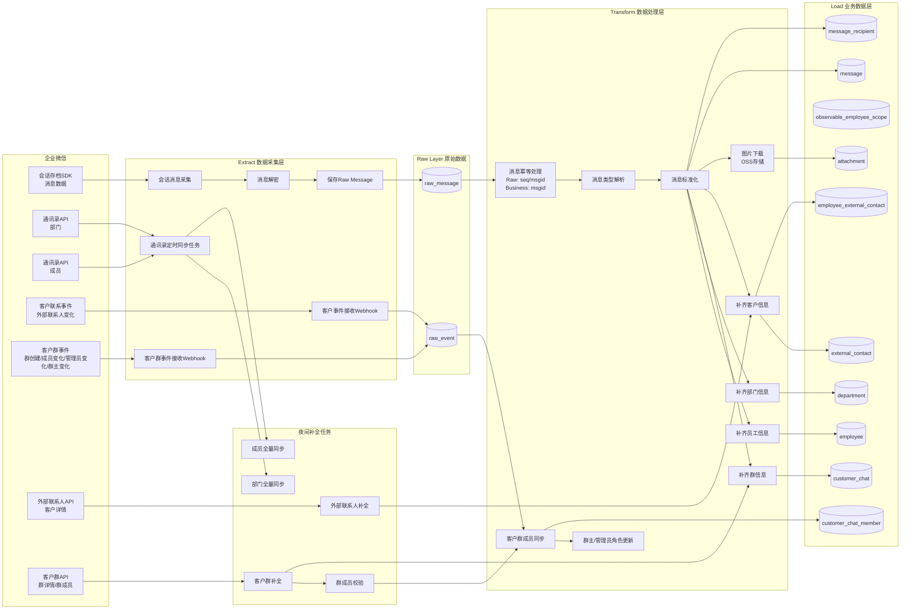
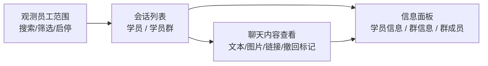

# 目标
用于获取和解析企业微信的聊天服务
## 当前版本支持消息类型列表

| 消息类型             | 是否支持             |
| ---------------- | ---------------- |
| 文本               | ✅                |
| 图片               | ✅                |
| 撤回消息             | ✅                |
| 同意会话存档           | ✅                |
| 语音               | ❌                |
| 视频               | ❌                |
| 表情               | ❌                |
| 文件               | ❌                |
| 链接               | ✅                |
| 小程序消息            | ❌                |
| 会话记录消息           | ❌                |
| 会话记录消息 Item      | ❌                |
| Markdown 格式消息    | ❌                |
| 图文消息             | ❌                |
| 日程消息             | ❌                |
| 混合消息             | ❌                |
| 音频存档消息（企业微信会议）   | ❌（需额外采购企业微信相关服务） |
| 互通红包消息           | ❌                |
| 视频号消息            | ❌                |
| 音视频通话（企业微信音视频通话） | ❌（需额外采购企业微信相关服务） |
| 微盘消息             | ❌                |
| 接龙消息             | ❌                |
| 笔记消息             | ❌                |

## 版本功能范围
## 2026-07-10 版本
**实现核心功能** ：
* 通讯录实时同步 与 T+1对齐
* [Extract]原始对话数据的采集与落库
* [Transform]原始对话数据的去重、对话信息的补齐与转录（时间，对话人，群的metaData)
* [load]处理后对话数据的落库

## 流程设计

## 数据库结构设计

### 设计约定

* 当前版本只支持单个企业微信主体，不在业务表中设计 `corp_id`。
* Raw Layer 保留企业微信接口原始返回，业务数据层保存标准化后可分析的数据。
* 会话存档 SDK 的 `GetChatData` 返回包包含 `seq`，`seq` 用于拉取游标、断点续拉和 Raw 层幂等控制。
* 解密后的消息以 `msgid` 作为业务唯一键；`seq` 在 `message` 中保留为溯源字段。
* 客户、客户群、通讯录等 webhook 事件统一进入 `raw_event`，不单独维护 `raw_contact_event`。
* 撤回消息不作为单独业务消息写入 `message`。收到 `msgtype = revoke` 或 `action = recall` 时，按 `revoke.pre_msgid` 标记原消息的撤回状态。
* 时间字段统一使用 `datetime` 保存业务时间；企业微信毫秒时间戳同时保留在对应的 `*_time_ms` 字段，便于排查原始数据。
* JSON 字段用于保存接口原始结构和暂不展开的扩展字段；高频分析字段必须拆成独立列。

### 表清单

| 层级 | 表名 | 说明 |
| --- | --- | --- |
| Raw | `raw_message` | 会话存档 SDK 拉取到的密文、明文和处理状态 |
| Raw | `raw_event` | 客户、客户群、通讯录等 webhook 原始事件 |
| Control | `sync_cursor` | 同步任务游标和运行状态 |
| Business | `department` | 企业微信部门 |
| Business | `employee` | 企业成员 |
| Business | `observable_employee_scope` | 前端可观测员工账号范围 |
| Business | `conversation_view_history` | 前端会话最近查看记录 |
| Business | `external_contact` | 外部联系人/客户 |
| Business | `employee_external_contact` | 员工与外部联系人的关系、备注和标签 |
| Business | `customer_chat` | 客户群 |
| Business | `customer_chat_member` | 客户群成员关系 |
| Business | `message` | 标准化后的业务消息 |
| Business | `message_recipient` | 消息接收人明细 |
| Business | `attachment` | 图片等媒体附件元数据和 OSS 地址 |

### Raw 表

#### `raw_message`

保存 `GetChatData` 返回的密文记录和解密后的完整 JSON。该表是消息采集链路的幂等入口。

| 字段 | 类型 | 是否必填 | 说明 |
| --- | --- | --- | --- |
| `id` | bigint | 是 | 主键，自增 |
| `seq` | unsigned bigint | 是 | 企业微信会话存档返回的消息序号，用于续拉 |
| `msgid` | varchar(128) | 是 | 企业微信消息唯一标识 |
| `publickey_ver` | int | 是 | 加密使用的公钥版本 |
| `encrypt_random_key` | text | 是 | 企业微信返回的加密随机密钥 |
| `encrypt_chat_msg` | longtext | 是 | 企业微信返回的加密消息体 |
| `decrypt_payload` | json | 否 | SDK 解密后的完整消息 JSON |
| `msg_action` | varchar(32) | 否 | 解密后 `action`，如 `send`、`recall`、`switch` |
| `msg_type` | varchar(64) | 否 | 解密后 `msgtype` |
| `msg_time_ms` | bigint | 否 | 解密后 `msgtime`，毫秒时间戳 |
| `msg_time` | datetime | 否 | 转换后的消息时间 |
| `process_status` | varchar(32) | 是 | 处理状态：`pending`、`processed`、`failed`、`ignored` |
| `process_error` | text | 否 | 解密或转换失败原因 |
| `fetched_at` | datetime | 是 | 拉取时间 |
| `decrypted_at` | datetime | 否 | 解密完成时间 |
| `processed_at` | datetime | 否 | 转换入业务层时间 |
| `created_at` | datetime | 是 | 创建时间 |
| `updated_at` | datetime | 是 | 更新时间 |

约束与索引：

| 类型 | 字段 | 说明 |
| --- | --- | --- |
| 唯一约束 | `seq` | 防止同一 SDK 游标消息重复入 Raw |
| 唯一约束 | `msgid` | 防止同一业务消息重复入 Raw |
| 索引 | `process_status, seq` | 支持按游标顺序处理待转换消息 |
| 索引 | `msg_time` | 支持按消息时间排查 |

#### `raw_event`

保存企业微信 webhook 原始事件。客户事件、客户群事件、通讯录事件共用该表。

| 字段 | 类型 | 是否必填 | 说明 |
| --- | --- | --- | --- |
| `id` | bigint | 是 | 主键，自增 |
| `event_source` | varchar(64) | 是 | 事件来源：`contact`、`customer_chat`、`department`、`employee` |
| `event_type` | varchar(128) | 是 | 企业微信事件类型 |
| `event_key` | varchar(256) | 否 | 事件幂等键，优先使用企业微信事件 ID；没有事件 ID 时由关键字段计算 |
| `external_userid` | varchar(128) | 否 | 事件关联外部联系人 ID |
| `chat_id` | varchar(128) | 否 | 事件关联客户群 ID |
| `userid` | varchar(128) | 否 | 事件关联企业成员 ID |
| `event_time_ms` | bigint | 否 | 企业微信事件时间戳，毫秒 |
| `event_time` | datetime | 否 | 转换后的事件时间 |
| `payload` | json | 是 | 原始事件 JSON |
| `process_status` | varchar(32) | 是 | 处理状态：`pending`、`processed`、`failed`、`ignored` |
| `process_error` | text | 否 | 处理失败原因 |
| `received_at` | datetime | 是 | webhook 接收时间 |
| `processed_at` | datetime | 否 | 处理完成时间 |
| `created_at` | datetime | 是 | 创建时间 |
| `updated_at` | datetime | 是 | 更新时间 |

约束与索引：

| 类型 | 字段 | 说明 |
| --- | --- | --- |
| 唯一约束 | `event_key` | 支持 webhook 重试幂等 |
| 索引 | `process_status, received_at` | 支持异步消费 |
| 索引 | `event_source, event_type, event_time` | 支持按事件类型排查 |
| 索引 | `chat_id` | 支持客户群事件回溯 |
| 索引 | `external_userid` | 支持客户事件回溯 |

### Control 表

#### `sync_cursor`

记录各类同步任务的游标和运行结果。

| 字段 | 类型 | 是否必填 | 说明 |
| --- | --- | --- | --- |
| `id` | bigint | 是 | 主键，自增 |
| `cursor_type` | varchar(64) | 是 | 游标类型：`message_seq`、`department_full_sync`、`employee_full_sync`、`external_contact_full_sync`、`customer_chat_full_sync` |
| `cursor_value` | varchar(256) | 否 | 游标值；消息同步保存最大 `seq` |
| `last_success_at` | datetime | 否 | 最近成功时间 |
| `last_run_at` | datetime | 否 | 最近运行时间 |
| `last_error` | text | 否 | 最近失败原因 |
| `created_at` | datetime | 是 | 创建时间 |
| `updated_at` | datetime | 是 | 更新时间 |

约束与索引：

| 类型 | 字段 | 说明 |
| --- | --- | --- |
| 唯一约束 | `cursor_type` | 每类任务只有一条当前游标 |

### Business 表

#### `department`

| 字段 | 类型 | 是否必填 | 说明 |
| --- | --- | --- | --- |
| `id` | bigint | 是 | 主键，自增 |
| `department_id` | bigint | 是 | 企业微信部门 ID |
| `parent_department_id` | bigint | 否 | 父部门 ID |
| `name` | varchar(255) | 是 | 部门名称 |
| `name_en` | varchar(255) | 否 | 英文名称 |
| `order_no` | int | 否 | 企业微信部门排序 |
| `is_deleted` | boolean | 是 | 是否已删除 |
| `raw_payload` | json | 否 | 最近一次同步的部门原始数据 |
| `last_synced_at` | datetime | 是 | 最近同步时间 |
| `created_at` | datetime | 是 | 创建时间 |
| `updated_at` | datetime | 是 | 更新时间 |

约束与索引：

| 类型 | 字段 | 说明 |
| --- | --- | --- |
| 唯一约束 | `department_id` | 企业微信部门唯一 |
| 索引 | `parent_department_id` | 支持部门树查询 |

#### `employee`

| 字段 | 类型 | 是否必填 | 说明 |
| --- | --- | --- | --- |
| `id` | bigint | 是 | 主键，自增 |
| `userid` | varchar(128) | 是 | 企业微信成员 ID |
| `name` | varchar(255) | 否 | 成员名称 |
| `alias` | varchar(255) | 否 | 别名 |
| `mobile` | varchar(64) | 否 | 手机号 |
| `email` | varchar(255) | 否 | 邮箱 |
| `avatar` | text | 否 | 头像 URL |
| `position` | varchar(255) | 否 | 职务 |
| `department_ids` | json | 否 | 所属部门 ID 数组 |
| `main_department_id` | bigint | 否 | 主部门 ID |
| `status` | int | 否 | 企业微信成员状态 |
| `is_deleted` | boolean | 是 | 是否已删除 |
| `raw_payload` | json | 否 | 最近一次同步的成员原始数据 |
| `last_synced_at` | datetime | 是 | 最近同步时间 |
| `created_at` | datetime | 是 | 创建时间 |
| `updated_at` | datetime | 是 | 更新时间 |

约束与索引：

| 类型 | 字段 | 说明 |
| --- | --- | --- |
| 唯一约束 | `userid` | 企业微信成员唯一 |
| 索引 | `main_department_id` | 支持按主部门过滤 |
| 索引 | `status` | 支持成员状态过滤 |

#### `observable_employee_scope`

配置前端可观测的员工账号范围。该表只控制前端可查看的员工通讯录范围，不影响底层员工、客户、客户群和消息的全量同步。

| 字段 | 类型 | 是否必填 | 说明 |
| --- | --- | --- | --- |
| `id` | bigint | 是 | 主键，自增 |
| `userid` | varchar(128) | 是 | 可被观测的企业微信成员 ID |
| `scope_status` | varchar(32) | 是 | 状态：`enabled`、`disabled` |
| `scope_reason` | varchar(500) | 否 | 纳入或移出观测范围的说明 |
| `created_by` | varchar(128) | 否 | 配置人 ID |
| `updated_by` | varchar(128) | 否 | 最近更新人 ID |
| `created_at` | datetime | 是 | 创建时间 |
| `updated_at` | datetime | 是 | 更新时间 |

约束与索引：

| 类型 | 字段 | 说明 |
| --- | --- | --- |
| 唯一约束 | `userid` | 一个员工只有一条观测配置 |
| 索引 | `scope_status, userid` | 支持前端只加载启用员工 |

#### `conversation_view_history`

记录前端用户在某个被观测员工视角下最近查看过的学员或学员群，用于会话列表“最近查看”排序。

| 字段 | 类型 | 是否必填 | 说明 |
| --- | --- | --- | --- |
| `id` | bigint | 是 | 主键，自增 |
| `observer_userid` | varchar(128) | 是 | 被观测员工 ID |
| `conversation_type` | varchar(32) | 是 | 会话类型：`student`、`customer_chat` |
| `external_userid` | varchar(128) | 否 | 学员 ID；`conversation_type = student` 时必填 |
| `chat_id` | varchar(128) | 否 | 客户群 ID；`conversation_type = customer_chat` 时必填 |
| `last_viewed_at` | datetime | 是 | 最近查看时间 |
| `view_count` | int | 是 | 累计查看次数 |
| `created_at` | datetime | 是 | 创建时间 |
| `updated_at` | datetime | 是 | 更新时间 |

约束与索引：

| 类型 | 字段 | 说明 |
| --- | --- | --- |
| 唯一约束 | `observer_userid, conversation_type, external_userid` | 同一员工视角下一个学员只有一条最近查看记录；`external_userid` 为空时由实现侧兜底 |
| 唯一约束 | `observer_userid, conversation_type, chat_id` | 同一员工视角下一个客户群只有一条最近查看记录；`chat_id` 为空时由实现侧兜底 |
| 索引 | `observer_userid, last_viewed_at` | 支持按最近查看排序 |

#### `external_contact`

| 字段 | 类型 | 是否必填 | 说明 |
| --- | --- | --- | --- |
| `id` | bigint | 是 | 主键，自增 |
| `external_userid` | varchar(128) | 是 | 外部联系人 ID |
| `name` | varchar(255) | 否 | 客户名称 |
| `avatar` | text | 否 | 头像 URL |
| `type` | int | 否 | 外部联系人类型 |
| `gender` | int | 否 | 性别 |
| `unionid` | varchar(128) | 否 | 微信 unionid |
| `corp_name` | varchar(255) | 否 | 外部联系人企业名称 |
| `corp_full_name` | varchar(255) | 否 | 外部联系人企业全称 |
| `is_deleted` | boolean | 是 | 是否已删除或已流失 |
| `raw_payload` | json | 否 | 最近一次同步的客户原始数据 |
| `last_synced_at` | datetime | 是 | 最近同步时间 |
| `created_at` | datetime | 是 | 创建时间 |
| `updated_at` | datetime | 是 | 更新时间 |

约束与索引：

| 类型 | 字段 | 说明 |
| --- | --- | --- |
| 唯一约束 | `external_userid` | 外部联系人唯一 |
| 索引 | `unionid` | 支持与其他系统关联 |

#### `employee_external_contact`

保存员工视角下的客户关系信息。客户基础信息仍在 `external_contact` 全量保存；员工对客户的备注、描述、标签等关系属性保存在本表。前端查看某个被观测员工名下学员时，以本表作为入口。

| 字段 | 类型 | 是否必填 | 说明 |
| --- | --- | --- | --- |
| `id` | bigint | 是 | 主键，自增 |
| `userid` | varchar(128) | 是 | 企业微信成员 ID |
| `external_userid` | varchar(128) | 是 | 外部联系人 ID |
| `remark` | varchar(255) | 否 | 员工给客户设置的备注 |
| `description` | text | 否 | 员工给客户设置的描述 |
| `remark_corp_name` | varchar(255) | 否 | 员工备注的客户企业名称 |
| `remark_mobiles` | json | 否 | 员工备注的客户手机号列表 |
| `tag_ids` | json | 否 | 员工给客户打的企业标签 ID 列表 |
| `add_way` | int | 否 | 添加客户来源 |
| `add_time` | datetime | 否 | 添加客户时间 |
| `add_time_ms` | bigint | 否 | 添加客户时间戳 |
| `is_deleted` | boolean | 是 | 该员工是否已删除或流失该客户 |
| `raw_payload` | json | 否 | 最近一次同步的员工-客户关系原始数据 |
| `last_synced_at` | datetime | 是 | 最近同步时间 |
| `created_at` | datetime | 是 | 创建时间 |
| `updated_at` | datetime | 是 | 更新时间 |

约束与索引：

| 类型 | 字段 | 说明 |
| --- | --- | --- |
| 唯一约束 | `userid, external_userid` | 一个员工与一个客户只有一条当前关系 |
| 索引 | `external_userid` | 支持按客户反查关联员工 |
| 索引 | `userid, is_deleted` | 支持前端查询员工名下有效学员 |
| 索引 | `remark` | 支持按备注搜索学员 |

#### `customer_chat`

| 字段 | 类型 | 是否必填 | 说明 |
| --- | --- | --- | --- |
| `id` | bigint | 是 | 主键，自增 |
| `chat_id` | varchar(128) | 是 | 企业微信客户群 ID，对应消息 `roomid` |
| `name` | varchar(255) | 否 | 群名称 |
| `owner_userid` | varchar(128) | 否 | 群主成员 ID |
| `notice` | text | 否 | 群公告 |
| `member_count` | int | 否 | 当前成员数 |
| `admin_userids` | json | 否 | 管理员成员 ID 数组 |
| `create_time` | datetime | 否 | 群创建时间 |
| `create_time_ms` | bigint | 否 | 群创建时间戳 |
| `status` | varchar(32) | 是 | 状态：`active`、`dismissed`、`unknown` |
| `raw_payload` | json | 否 | 最近一次同步的群原始数据 |
| `last_synced_at` | datetime | 是 | 最近同步时间 |
| `created_at` | datetime | 是 | 创建时间 |
| `updated_at` | datetime | 是 | 更新时间 |

约束与索引：

| 类型 | 字段 | 说明 |
| --- | --- | --- |
| 唯一约束 | `chat_id` | 客户群唯一 |
| 索引 | `owner_userid` | 支持按群主过滤 |
| 索引 | `status` | 支持过滤有效群 |

#### `customer_chat_member`

| 字段 | 类型 | 是否必填 | 说明 |
| --- | --- | --- | --- |
| `id` | bigint | 是 | 主键，自增 |
| `chat_id` | varchar(128) | 是 | 客户群 ID |
| `member_userid` | varchar(128) | 是 | 成员 ID，可能是企业成员 `userid` 或外部联系人 `external_userid` |
| `member_type` | varchar(32) | 是 | 成员类型：`employee`、`external_contact`、`unknown` |
| `name` | varchar(255) | 否 | 企业微信返回的成员名称；仅 `need_name = 1` 时返回 |
| `group_nickname` | varchar(255) | 否 | 成员在群里的昵称 |
| `join_time` | datetime | 否 | 入群时间 |
| `join_time_ms` | bigint | 否 | 入群时间戳 |
| `join_scene` | int | 否 | 入群场景 |
| `role` | varchar(32) | 是 | 群角色：`owner`、`admin`、`member` |
| `invitor_userid` | varchar(128) | 否 | 邀请人 ID |
| `is_active` | boolean | 是 | 当前是否仍在群内 |
| `left_at` | datetime | 否 | 离群时间 |
| `raw_payload` | json | 否 | 最近一次同步的群成员原始数据 |
| `last_synced_at` | datetime | 是 | 最近同步时间 |
| `created_at` | datetime | 是 | 创建时间 |
| `updated_at` | datetime | 是 | 更新时间 |

约束与索引：

| 类型 | 字段 | 说明 |
| --- | --- | --- |
| 唯一约束 | `chat_id, member_userid` | 一个成员在一个群内只有一条当前关系 |
| 索引 | `member_userid, member_type` | 支持按成员查群 |
| 索引 | `chat_id, is_active` | 支持查询当前群成员 |
| 索引 | `role` | 支持群主/管理员查询 |

#### `message`

保存分析使用的标准化消息。仅对 `action = send` 的有效业务消息插入该表；撤回消息只更新已有消息。

| 字段 | 类型 | 是否必填 | 说明 |
| --- | --- | --- | --- |
| `id` | bigint | 是 | 主键，自增 |
| `raw_message_id` | bigint | 是 | 对应 `raw_message.id` |
| `seq` | unsigned bigint | 是 | 原始拉取返回的 seq，便于溯源 |
| `msgid` | varchar(128) | 是 | 企业微信消息唯一标识 |
| `action` | varchar(32) | 是 | 消息动作，当前业务入库主要为 `send` |
| `msg_type` | varchar(64) | 是 | 消息类型：`text`、`image`、`link`、`agree` 等 |
| `conversation_type` | varchar(32) | 是 | 会话类型：`single`、`room` |
| `roomid` | varchar(128) | 否 | 群聊 ID；单聊为空 |
| `sender_id` | varchar(128) | 是 | 发送方 ID |
| `sender_type` | varchar(32) | 是 | 发送方类型：`employee`、`external_contact`、`bot`、`unknown` |
| `sender_name` | varchar(255) | 否 | 发送方名称快照 |
| `content_text` | longtext | 否 | 标准化文本内容；文本、链接标题/描述等可写入 |
| `link_title` | varchar(500) | 否 | 链接标题 |
| `link_url` | text | 否 | 链接 URL |
| `link_description` | text | 否 | 链接描述 |
| `msg_time_ms` | bigint | 是 | 企业微信消息发送时间，毫秒 |
| `msg_time` | datetime | 是 | 消息发送时间 |
| `is_external` | boolean | 是 | 是否外部消息，可由 `msgid` 后缀或发送方类型判断 |
| `is_recalled` | boolean | 是 | 是否已被撤回 |
| `recalled_at` | datetime | 否 | 撤回发生时间 |
| `recall_raw_message_id` | bigint | 否 | 触发撤回的 `raw_message.id` |
| `raw_payload` | json | 是 | 解密后的完整消息 JSON |
| `created_at` | datetime | 是 | 创建时间 |
| `updated_at` | datetime | 是 | 更新时间 |

约束与索引：

| 类型 | 字段 | 说明 |
| --- | --- | --- |
| 唯一约束 | `msgid` | 业务消息去重 |
| 唯一约束 | `raw_message_id` | 一条 Raw 消息最多生成一条业务消息 |
| 索引 | `seq` | 支持按 SDK 拉取顺序排查 |
| 索引 | `roomid, msg_time` | 支持群聊时间线分析 |
| 索引 | `sender_id, msg_time` | 支持发送人维度分析 |
| 索引 | `msg_type, msg_time` | 支持消息类型分析 |
| 索引 | `is_recalled` | 支持过滤撤回消息 |

#### `message_recipient`

保存 `tolist` 接收人数组，避免业务分析依赖 JSON 解析。

| 字段 | 类型 | 是否必填 | 说明 |
| --- | --- | --- | --- |
| `id` | bigint | 是 | 主键，自增 |
| `message_id` | bigint | 是 | 对应 `message.id` |
| `msgid` | varchar(128) | 是 | 企业微信消息 ID，冗余便于排查 |
| `recipient_id` | varchar(128) | 是 | 接收方 ID |
| `recipient_type` | varchar(32) | 是 | 接收方类型：`employee`、`external_contact`、`bot`、`unknown` |
| `recipient_name` | varchar(255) | 否 | 接收方名称快照 |
| `created_at` | datetime | 是 | 创建时间 |

约束与索引：

| 类型 | 字段 | 说明 |
| --- | --- | --- |
| 唯一约束 | `message_id, recipient_id` | 防止接收人重复 |
| 索引 | `recipient_id, created_at` | 支持按接收人查询消息 |

#### `attachment`

保存图片等媒体附件。当前版本主要支持图片下载与 OSS 存储，后续可扩展文件、视频、语音。

| 字段 | 类型 | 是否必填 | 说明 |
| --- | --- | --- | --- |
| `id` | bigint | 是 | 主键，自增 |
| `message_id` | bigint | 是 | 对应 `message.id` |
| `msgid` | varchar(128) | 是 | 企业微信消息 ID，冗余便于排查 |
| `attachment_type` | varchar(64) | 是 | 附件类型：`image`、`file`、`video`、`voice` |
| `sdkfileid` | text | 是 | 企业微信媒体资源 ID |
| `md5sum` | varchar(128) | 否 | 企业微信返回的 MD5 |
| `file_size` | bigint | 否 | 文件大小，字节 |
| `file_name` | varchar(500) | 否 | 文件名 |
| `file_ext` | varchar(64) | 否 | 文件扩展名 |
| `oss_bucket` | varchar(255) | 否 | OSS bucket |
| `oss_key` | text | 否 | OSS object key |
| `oss_url` | text | 否 | 可访问地址或内部地址 |
| `download_status` | varchar(32) | 是 | 下载状态：`pending`、`downloaded`、`failed`、`ignored` |
| `download_error` | text | 否 | 下载失败原因 |
| `downloaded_at` | datetime | 否 | 下载完成时间 |
| `raw_payload` | json | 否 | 附件原始 JSON |
| `created_at` | datetime | 是 | 创建时间 |
| `updated_at` | datetime | 是 | 更新时间 |

约束与索引：

| 类型 | 字段 | 说明 |
| --- | --- | --- |
| 唯一约束 | `message_id, attachment_type, md5sum` | 防止同一消息附件重复入库；`md5sum` 为空时由实现侧兜底处理 |
| 索引 | `msgid` | 支持按消息排查附件 |
| 索引 | `download_status, created_at` | 支持异步下载任务 |
| 索引 | `md5sum` | 支持附件去重和校验 |

### 撤回消息处理规则

收到解密消息 `action = recall` 或 `msgtype = revoke` 时：

1. `raw_message` 正常入库并保存完整 `decrypt_payload`。
2. 不向 `message` 插入新的业务消息。
3. 从 `decrypt_payload.revoke.pre_msgid` 读取被撤回消息 ID。
4. 若 `message.msgid = pre_msgid` 已存在，则更新：
   * `is_recalled = true`
   * `recalled_at = recall.msgtime`
   * `recall_raw_message_id = raw_message.id`
5. 若原消息尚未入库，则该 `raw_message` 保持 `processed`，后续补偿任务可根据 `pre_msgid` 再次尝试标记。

### 消息入库规则

| 企业微信消息 | Raw 入库 | Business 入库 | 处理方式 |
| --- | --- | --- | --- |
| `text` | 是 | 是 | 写入 `message.content_text` |
| `image` | 是 | 是 | 写入 `message`，并写入 `attachment` 等待下载 |
| `link` | 是 | 是 | 写入 `message.link_*` 和 `content_text` |
| `agree` / `disagree` | 是 | 是 | 作为系统类业务消息写入 `message`，内容保存在 `raw_payload`，后续分析可按需过滤 |
| `revoke` / `recall` | 是 | 否 | 只标记原消息撤回状态 |
| 暂不支持的消息类型 | 是 | 否 | `raw_message.process_status = ignored`，保留原始数据 |

### 客户与客户群关系规则

#### 员工-客户关系

* `external_contact` 保存客户全局基础信息，包括微信昵称、头像、性别、unionid 等。
* `employee_external_contact` 保存员工视角的客户关系信息，包括该员工给客户设置的备注、描述、手机号、标签和添加时间。
* 若被观测员工已添加该学员为联系人，前端学员展示名优先使用 `employee_external_contact.remark`。
* 若被观测员工未添加该学员为联系人，或 `remark` 为空，前端学员展示名使用 `external_contact.name`。
* 底层客户信息仍然全量同步；`observable_employee_scope` 只控制前端可查看哪些员工名下的信息。

#### 客户群成员角色

客户群详情接口字段映射：

| 企业微信字段 | 入库字段 | 说明 |
| --- | --- | --- |
| `group_chat.owner` | `customer_chat.owner_userid` | 群主 ID |
| `group_chat.admin_list[].userid` | `customer_chat.admin_userids` | 管理员 ID 列表 |
| `group_chat.member_list[].userid` | `customer_chat_member.member_userid` | 群成员 ID |
| `group_chat.member_list[].type` | `customer_chat_member.member_type` | `1` 为企业成员，`2` 为外部联系人 |
| `group_chat.member_list[].group_nickname` | `customer_chat_member.group_nickname` | 群昵称 |
| `group_chat.member_list[].name` | `customer_chat_member.name` | 成员名称，需请求 `need_name = 1` |

角色判定优先级：

1. 若 `member_userid = customer_chat.owner_userid`，展示为群主。
2. 若 `member_userid` 在 `customer_chat.admin_userids` 中，展示为管理员。
3. 若 `member_type = employee`，展示为企业员工。
4. 若 `member_type = external_contact`，展示为学员。

被观测员工不要求是群主或管理员；只要该员工是群内企业员工，即可在前端进入该员工关联的学员群查看聊天内容。

## 前端信息架构设计

### 目标

提供一个用于查看企业微信会话内容的网页界面。用户可以在可观测员工账号范围内搜索员工，并查看该员工名下学员、该员工所在学员群及对应聊天内容。

前端只控制查看范围，不控制数据同步范围：

* 员工、客户、客户群、群成员、消息底层仍全量同步。
* 前端只能选择 `observable_employee_scope.scope_status = enabled` 的员工账号作为观测对象。
* 学员和学员群列表都从被观测员工视角派生。

### 页面整体布局

### 一级信息结构

| 区域 | 作用 | 主要数据来源 |
| --- | --- | --- |
| 观测员工范围 | 设置和选择可查看的企业微信员工账号 | `observable_employee_scope`、`employee`、`department` |
| 会话列表 | 展示该员工名下学员和该员工所在学员群 | `employee_external_contact`、`external_contact`、`customer_chat`、`customer_chat_member`、`conversation_view_history`、`message` |
| 聊天内容 | 展示单聊或群聊消息时间线 | `message`、`message_recipient`、`attachment` |
| 信息面板 | 展示当前学员或学员群详情 | `external_contact`、`employee_external_contact`、`customer_chat`、`customer_chat_member`、`employee` |

### 观测员工范围

功能：

* 支持按员工姓名、userid、部门搜索员工。
* 支持将员工加入或移出可观测范围。
* 支持启用/停用已配置的可观测员工账号。
* 前端默认只显示启用状态的观测员工。

展示字段：

| 字段 | 来源 | 说明 |
| --- | --- | --- |
| 员工名称 | `employee.name` | 主展示名 |
| 员工 ID | `employee.userid` | 精确搜索和排查 |
| 头像 | `employee.avatar` | 列表头像 |
| 部门 | `employee.main_department_id` + `department.name` | 辅助筛选 |
| 观测状态 | `observable_employee_scope.scope_status` | 启用或停用 |

### 会话列表

会话列表在选定一个被观测员工后展示，分为两个视图：

| 视图 | 说明 | 数据来源 |
| --- | --- | --- |
| 学员 | 被观测员工添加过的外部联系人 | `employee_external_contact` join `external_contact` |
| 学员群 | 被观测员工所在的客户群 | `customer_chat_member` join `customer_chat` |

排序规则：

1. 优先按 `conversation_view_history.last_viewed_at` 排序；若没有查看记录，则按最近消息时间排序。
2. 最近消息时间来自 `message.msg_time`。
3. 学员单聊最近消息需匹配该员工与该学员之间的单聊消息。
4. 学员群最近消息需匹配 `message.roomid = customer_chat.chat_id`。

学员列表展示字段：

| 字段 | 来源 | 说明 |
| --- | --- | --- |
| 展示名 | `employee_external_contact.remark` -> `external_contact.name` | 备注优先 |
| 微信昵称 | `external_contact.name` | 信息面板展示 |
| 头像 | `external_contact.avatar` | 列表头像 |
| 所属员工 | `employee.name` | 当前观测员工 |
| 最近消息摘要 | `message.content_text` 或消息类型摘要 | 空内容时展示消息类型 |
| 最近消息时间 | `message.msg_time` | 列表排序 |

学员群列表展示字段：

| 字段 | 来源 | 说明 |
| --- | --- | --- |
| 群名称 | `customer_chat.name` | 主展示名 |
| 群主 | `customer_chat.owner_userid` join `employee.name` | 群主可能不是当前观测员工 |
| 成员数 | `customer_chat.member_count` | 群规模 |
| 当前观测员工角色 | `customer_chat_member.role` 或角色判定规则 | 群主/管理员/企业员工 |
| 最近消息摘要 | `message.content_text` 或消息类型摘要 | 空内容时展示消息类型 |
| 最近消息时间 | `message.msg_time` | 列表排序 |

### 聊天内容查看

#### 学员单聊

查询范围：

* `message.conversation_type = single`
* `message.sender_id` 与 `message_recipient.recipient_id` 中同时包含被观测员工 `userid` 和学员 `external_userid`

消息展示：

| 消息类型 | 展示方式 |
| --- | --- |
| `text` | 文本气泡 |
| `image` | 图片缩略图，点击查看原图或 OSS 地址 |
| `link` | 链接卡片，展示标题、描述和 URL |
| `agree` / `disagree` | 系统消息样式 |
| 已撤回消息 | 原消息位置展示“消息已撤回”状态 |
| 暂不支持类型 | 不展示业务消息；如后续入库可展示“暂不支持的消息类型” |

#### 学员群聊

查询范围：

* `message.conversation_type = room`
* `message.roomid = customer_chat.chat_id`

消息发出者展示：

| 字段 | 取值规则 |
| --- | --- |
| 发送者角色 | 群主 -> 管理员 -> 企业员工 -> 学员 |
| 发送者展示名 | `customer_chat_member.group_nickname` -> `employee_external_contact.remark` -> `external_contact.name` / `employee.name` |
| 发送者头像 | 外部联系人取 `external_contact.avatar`；企业员工取 `employee.avatar` |

备注说明：

* 群内学员的备注取当前被观测员工对该学员的 `employee_external_contact.remark`。
* 若当前被观测员工未添加该学员为联系人，则没有该员工视角备注，展示微信昵称。
* 企业员工不使用客户备注，展示 `employee.name`。

### 学员信息面板

打开学员单聊或点击群内学员时展示。

| 信息 | 来源 | 说明 |
| --- | --- | --- |
| 展示名 | `employee_external_contact.remark` -> `external_contact.name` | 备注优先 |
| 微信昵称 | `external_contact.name` | 原始昵称 |
| 头像 | `external_contact.avatar` | 学员头像 |
| 备注 | `employee_external_contact.remark` | 当前观测员工视角 |
| 描述 | `employee_external_contact.description` | 当前观测员工视角 |
| 企业名称 | `external_contact.corp_name` / `corp_full_name` | 客户企业信息 |
| 性别 | `external_contact.gender` | 原始字段 |
| unionid | `external_contact.unionid` | 如有权限获取则展示 |
| 关联员工 | `employee_external_contact.userid` join `employee.name` | 当前关系所属员工 |
| 添加时间 | `employee_external_contact.add_time` | 当前员工添加该客户时间 |
| 标签 | `employee_external_contact.tag_ids` | v1 可展示 ID，后续可扩展标签表 |

### 学员群信息面板

打开学员群或点击群信息入口时展示。

| 信息 | 来源 | 说明 |
| --- | --- | --- |
| 群名称 | `customer_chat.name` | 主展示 |
| 群主 | `customer_chat.owner_userid` join `employee.name` | 来自 `group_chat.owner` |
| 管理员 | `customer_chat.admin_userids` join `employee.name` | 来自 `group_chat.admin_list` |
| 群公告 | `customer_chat.notice` | 如有 |
| 成员数 | `customer_chat.member_count` | 当前成员数 |
| 群状态 | `customer_chat.status` | active/dismissed/unknown |
| 创建时间 | `customer_chat.create_time` | 群创建时间 |

群成员列表展示字段：

| 字段 | 来源 | 说明 |
| --- | --- | --- |
| 展示名 | `group_nickname` -> `remark` -> `name` | 群昵称优先 |
| 成员类型 | `customer_chat_member.member_type` | 企业员工/学员 |
| 群角色 | 角色判定规则 | 群主/管理员/企业员工/学员 |
| 头像 | `employee.avatar` / `external_contact.avatar` | 按成员类型取值 |
| 入群时间 | `customer_chat_member.join_time` | 如有 |
| 邀请人 | `customer_chat_member.invitor_userid` join `employee.name` | 仅企业微信返回时展示 |

### 搜索设计

全局搜索入口在选定观测员工后生效。

| 搜索对象 | 支持字段 | 结果行为 |
| --- | --- | --- |
| 员工 | `employee.name`、`userid`、部门 | 切换当前观测员工 |
| 学员 | `employee_external_contact.remark`、`external_contact.name`、`external_userid` | 打开学员单聊 |
| 学员群 | `customer_chat.name`、`chat_id`、群成员名称 | 打开群聊 |

搜索结果必须遵守 `observable_employee_scope`：

* 员工搜索只返回启用观测范围内的员工。
* 学员搜索只返回当前观测员工名下的学员。
* 学员群搜索只返回当前观测员工所在的客户群。

### 前端状态与交互

| 状态 | 说明 |
| --- | --- |
| 未选择观测员工 | 展示观测员工搜索与范围配置入口 |
| 已选择观测员工但无会话 | 展示空状态，提示该员工暂无可查看学员或学员群 |
| 学员会话选中 | 中间展示单聊消息，右侧展示学员信息 |
| 学员群选中 | 中间展示群聊消息，右侧展示群信息和成员列表 |
| 点击消息发送者 | 右侧切换为该成员的信息面板 |
| 图片消息点击 | 打开图片预览，来源为 `attachment.oss_url` |
| 撤回消息 | 保留原消息位置，展示撤回状态 |

### 前端数据接口建议

前端可以按以下逻辑组织接口或查询能力：

| 能力 | 入参 | 返回 |
| --- | --- | --- |
| 获取可观测员工 | 关键词、部门、状态 | 员工列表和观测状态 |
| 更新观测范围 | `userid`、`scope_status` | 更新后的观测配置 |
| 获取员工会话列表 | `userid`、视图类型、关键词、分页 | 学员或学员群列表 |
| 获取学员聊天 | `userid`、`external_userid`、分页游标 | 单聊消息列表 |
| 获取群聊天 | `userid`、`chat_id`、分页游标 | 群聊消息列表 |
| 更新最近查看 | `userid`、会话类型、`external_userid` 或 `chat_id` | 更新后的最近查看记录 |
| 获取学员信息 | `userid`、`external_userid` | 学员基础信息和员工视角备注 |
| 获取群信息 | `userid`、`chat_id` | 群基础信息、群主、管理员、成员列表 |

接口层必须校验 `userid` 是否在启用的 `observable_employee_scope` 中；不在范围内时拒绝查询对应学员和学员群。
