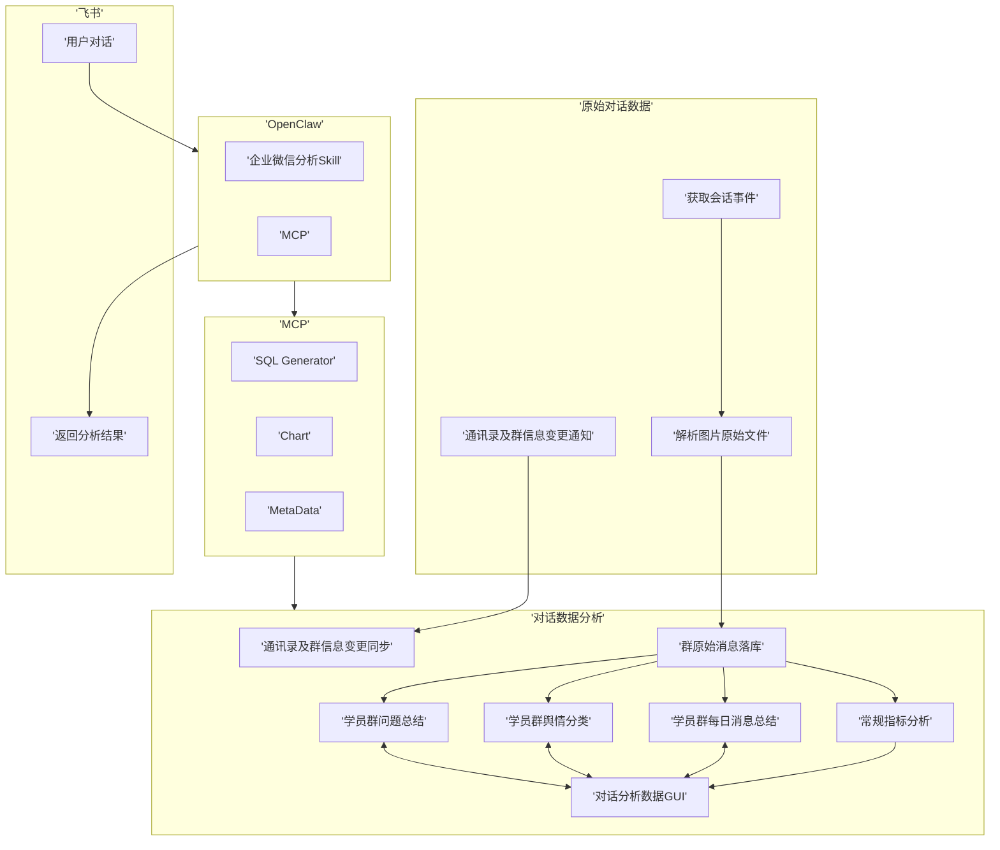

# 目标
开发一个可以接入到飞书的chatBI Agent，实现对企业微信群聊内容的分析

# 项目总体架构

# 技术方案选型
## Agent
LLM的Runtime选型采用openclaw，利用其对飞书的接入和runtime机制执行skill，限制权限为bash, read。

# 详细设计链接

[Projects/Beacon/WeCom/企业微信聊天同步服务 ](obsidian://open?vault=research&file=Projects%2FBeacon%2FWeCom%2F%E4%BC%81%E4%B8%9A%E5%BE%AE%E4%BF%A1%E8%81%8A%E5%A4%A9%E5%90%8C%E6%AD%A5%E6%9C%8D%E5%8A%A1)
